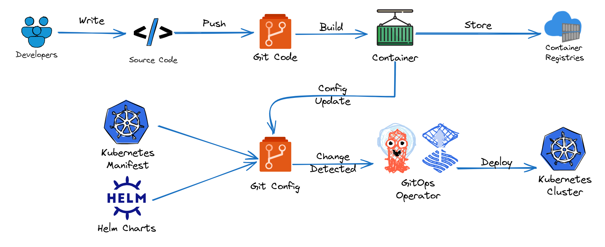

## 🌟 Why Your Cluster Isn’t What You Think It Is

If you’ve spent any time deploying to Kubernetes, you’ve probably seen it happen.

You apply your manifests. Everything seems fine—until it isn’t.  
Maybe a service behaves oddly in staging. Maybe prod doesn’t quite match what’s in Git.  
You double-check your YAML, open the terminal, run a few `kubectl` commands… and something feels off.

At first, it’s small things:
- A patch applied in a hurry during an incident
- A test configuration that accidentally made it to production
- A deployment that was rolled back manually, but not in Git

But over time, these little mismatches add up.

What’s written in Git starts to drift from what’s actually running.  
And when something breaks—or needs to be reproduced—the first step is often investigation, not resolution.

Not because anyone did something wrong.  
But because in Kubernetes, it’s easy to change what’s running—and hard to guarantee that those changes are tracked, versioned, or even visible.

Most teams recognise this problem at some point.  
They try to solve it in all the reasonable ways:
- Putting manifests in Git
- Creating scripts for consistency
- Adding CI/CD to automate deployment

And those steps do help. But they don’t eliminate the gap between Git and the cluster.  
They just narrow it—and not always reliably.

That gap is where confusion lives.  
It’s where production issues get harder to debug.
And it’s exactly the kind of problem that GitOps is designed to solve.

## 🤖 What Exactly Is GitOps?

GitOps is a way of managing your infrastructure and application deployments by using Git as the **single source of truth**—not just for your app code, but for your Kubernetes configuration too.

At its core, Git becomes the **blueprint** for your system.

- If it’s in Git, it should be running in your cluster.  
- If it’s not in Git, it shouldn’t be running at all.

Here’s the idea:

- You **declare** the desired state of your system in Git—using Kubernetes manifests, Helm charts, or other config files.
- A **GitOps controller** runs inside your cluster and watches Git continuously.
- If it sees a difference between what’s in Git and what’s running, it brings your cluster back in line—automatically.

This creates a powerful pattern that GitOps follows at all times:

> **Declare → Detect → Correct**

In other words, Git becomes more than just a versioned storage place—it becomes your **control centre**.  
Change something in Git, and the cluster follows.  
Drift from that state? The system detects and corrects it.

Think of GitOps like setting your cluster on **autopilot**:

- You chart the course in Git.
- The controller ensures your system stays on that course—day and night.

> But what does that actually look like in your real-world development workflow?  
> Let’s walk through that next.

## 🔁 What GitOps Looks Like in Real Life

So far, we’ve talked about GitOps in theory: Git is the source of truth, your cluster syncs to Git, and the system corrects itself when things drift.

But what does that actually look like in a real development workflow?

Let’s walk through it step-by-step—and compare how **things work today** versus how they change with GitOps.

### 🧱 The Traditional Workflow (Without GitOps)

Let’s start with a simplified version of how most teams deploy to Kubernetes today:

1. A developer writes code and pushes it to GitHub or another source repo.
2. This triggers a CI pipeline: tests run, an image is built, and it's pushed to a container registry.
3. The developer (or the pipeline) updates the Kubernetes manifest or Helm values file with the new image tag.
4. Someone runs `kubectl apply` to push that config into the cluster.

It works—but there are challenges:
- Manual steps or tightly coupled scripts
- CI pipelines often need direct access to the cluster
- Drift can creep in unnoticed if someone makes a manual change
- Rollbacks are possible, but usually require re-running scripts or remembering previous states

### 🔄 The GitOps Workflow

Here’s how things change with GitOps in place:

1. A developer pushes code → the CI system builds a container image and pushes it to a registry.
2. Separately, the developer (or another automated process) updates the **Kubernetes configuration**—for example, changing the image tag—in a Git repository that holds deployment configs.
3. This change to the config repo is **picked up by a GitOps controller**, which is running *inside the Kubernetes cluster*.
4. The controller **pulls the change** and applies it to the cluster—bringing the live state in line with what’s defined in Git.

And the loop doesn’t stop there:
- The controller **continuously checks** that the cluster matches Git
- If someone manually changes a config in the cluster, the controller reverts it to what’s declared
- If a pod crashes or disappears, it’s restored
- If the Git state changes again, the cluster updates automatically

### 🧭 What’s Actually Different?

At a glance, the steps might feel similar. But the shift in **who’s in control** is massive:

| Traditional Model (CI/CD) | GitOps Model |
|---------------------------|--------------|
| Pipeline **pushes** config into the cluster | Cluster **pulls** config from Git |
| Cluster state changes when the pipeline runs | Cluster state is continuously reconciled |
| CI/CD has direct access to the cluster | GitOps controller runs *inside* the cluster |
| Manual fixes risk introducing drift | Drift is detected and corrected automatically |
| Rollbacks require rerunning pipelines or restoring files | Rollbacks are just a `git revert` away |

### 🖼️ Let’s Look at It Visually

Here’s how the GitOps loop actually fits into this picture:

Notice a few key things:
- The **app code** and the **Kubernetes config** often live in *separate Git repos*
   - This separation keeps responsibilities clean: one for building, one for declaring what runs
- The GitOps controller doesn’t care about your CI/CD system—it only watches the config repo
- If that config repo changes, the controller reconciles your cluster accordingly

This is what we mean when we say GitOps sets your cluster on autopilot.

### 💡 And It’s Not Just About Mistakes

Sure, GitOps can recover from errors—but its real power is in how it simplifies *every single change*.

- Want to deploy a new version? Update the tag in Git.
- Need to scale a service? Change the replica count in Git.
- Want to roll back? Just revert the last commit.

Git becomes your **deployment dashboard**, your **audit log**, and your **operational command centre**—all in one.

### ⏭️ Where We’re Going Next

Now that you’ve seen what GitOps actually looks like in a development workflow, you’re ready to understand *why it works so well*—and how the four GitOps principles support this loop.

Let’s explore those next.

## 🧱 The Four Principles That Make GitOps Work

By now, you’ve seen what GitOps looks like in practice.

But what actually makes it so reliable, so consistent, and so… automatic?

It’s not magic. It’s a set of principles—clear, practical ideas—that guide how GitOps systems are designed. And they didn’t come out of nowhere.

As teams across the Kubernetes world struggled with drift, failed rollbacks, and broken pipelines, a better approach began to emerge. GitOps was born from those hard lessons—and over time, those patterns were formalised into four key principles.

These principles became the foundation of the **[OpenGitOps](https://opengitops.dev)** project, now backed by the **Cloud Native Computing Foundation (CNCF)**—the same organisation that hosts Kubernetes, Helm, and other cornerstone technologies.

> These four ideas aren’t just theory.  
> They’re the framework behind the GitOps loop you just saw—and the reason it works.

Let’s break them down.

### 🧱 1. Declarative Configuration  
> *Say what you want, not how to do it.*

Instead of writing long scripts that say "run this, then install that," you define your system’s **desired end state**—clearly and declaratively.

Whether you’re using Kubernetes manifests, Helm charts, or Kustomize overlays, the goal is the same:
- **You declare what you want**
- **The system figures out how to match it**

🛠️ Think of it like a contract:  
> “Whatever’s in Git is what the cluster should reflect. Nothing more, nothing less.”

That clarity makes it easier to reason about your system, reproduce it consistently, and debug problems without guesswork.

### 📚 2. Versioned and Immutable  
> *Every change is tracked. Every rollback is easy.*

In GitOps, all configuration lives in Git—where every change is:
- **Versioned**
- **Reviewed**
- **Traceable**

A pull request becomes the start of every deployment.  
A merge becomes the trigger.  
A rollback? Just revert the commit.

This gives you:
- 🔍 **Auditability** – no more guessing who changed what and when
- 🔄 **Instant rollbacks** – no pipelines, no rebuilding, just `git revert`
- 🤝 **Shared understanding** – config is clear, documented, and accessible

Git becomes not just your source of truth—but your entire change history.

### 🔄 3. Automatically Pulled  
> *The cluster stays in sync by watching Git—not waiting to be told what to do.*

In traditional pipelines, changes are **pushed** into the cluster after a build.  
GitOps flips that around.

A controller running **inside** your Kubernetes cluster continuously watches Git for changes.  
When it detects a new commit, it **pulls the update in automatically** and applies it.

That change makes a big difference:
- 🔐 **Improved security** – no need to expose the cluster to external systems
- 🔁 **Continuous sync** – updates don’t happen just once—they happen whenever needed

> The system doesn’t wait for someone to tell it what to do.  
> It watches Git and stays in sync—by design.

### ♻️ 4. Continuously Reconciled  
> *If something drifts, it gets fixed—automatically.*

Once your desired state is in Git, the controller **never stops comparing** it to what’s running.

If a pod disappears, a config is edited manually, or someone deletes a resource—it notices.  
And it corrects the change to bring your cluster **back in line with Git**.

That means:
- ✅ **Self-healing infrastructure**
- 🧘 **Fewer on-call surprises**
- 🔁 **Consistency you can trust**

You’re not waiting for the next deploy. You’re always aligned.

### 🧠 Why This Matters

These four principles aren’t academic.  
They’re the reason GitOps systems like Argo CD and Flux can deliver:
- Safer deployments  
- Faster recovery  
- Simpler debugging  
- And infrastructure that feels… predictable

> These principles don’t just guide tools.  
> They guide how **you** work—making complex systems feel simpler and more trustworthy.

Now, you might be wondering:

> _“Okay, but don’t I already have some of this with my CI/CD pipelines?”_

That’s a great question—and that’s where we’re going next.

## 🆚 CI/CD vs GitOps: What’s Actually Different?

If you’ve been reading and thinking,  
> “Wait, I already store my manifests in Git… I already deploy from a pipeline… isn’t that GitOps?”

You’re not wrong to wonder.

At first glance, GitOps can look a lot like traditional CI/CD.  
But there are two key shifts that make GitOps fundamentally different—and more powerful.

### 🔁 Push Once vs Pull Forever

Traditional CI/CD pipelines **push** changes into the cluster.  
Once the pipeline finishes, it’s done. The cluster state isn’t watched or updated unless another deploy happens.

GitOps flips that: a controller inside the cluster **pulls** changes from Git continuously.  
It watches, corrects, and aligns your live state with what’s declared—all the time.

> GitOps doesn't just deploy once.  
> It **never stops watching**.

### 🧠 CI/CD Is Ephemeral. GitOps Has a Memory.

CI/CD pipelines are transient.  
They run, deploy, and disappear. If something drifts later—manual edits, pod crashes, deleted configs—it’s up to you to notice and fix it.

GitOps **remembers**.  
It reconciles continuously. It can roll back instantly. And it acts like a quiet safety net that keeps your cluster honest—even when you're not looking.

### 🤔 So… Do I Still Need CI/CD?

Absolutely. GitOps isn’t a replacement for CI/CD—it’s a natural evolution of how we manage deployments.

You’ll still need:
- CI pipelines to build, test, and package your code
- Container registries to store your images
- Automation to update config files in Git

GitOps takes over **after** those steps—handling the deployment part with more safety, repeatability, and clarity.

## 🧭 When GitOps Might Feel Like Overkill

Let’s be honest: GitOps isn’t for everyone, and it isn’t needed everywhere.

If you’re managing a single, stable cluster with infrequent changes—or if your team isn’t ready to adopt a Git-first workflow—it might feel like unnecessary overhead.

But if you're dealing with:
- Frequent deployments
- Config drift
- On-call pain
- Manual rollback headaches
- Compliance or audit pressure

…then GitOps might be exactly what you’ve been missing.

## 🧘 What This Means for You

You don’t have to throw out your CI/CD pipeline.  
You don’t have to start over.  

What GitOps offers is a **model**—a different way to think about managing infrastructure.  
One that’s more observable, more trustworthy, and built on hard-won community lessons.

And starting tomorrow, you’ll get hands-on and see it in action.

### 🛣️ Up Next: Your First GitOps Lab

In Day 2, you’ll:
- Create a fully local Kubernetes cluster
- Install a GitOps controller
- Watch it reconcile your cluster in real time
- Make manual changes… and see the system fix them for you

It’s lightweight. No cloud needed. Just you, your laptop, and the GitOps loop—live and in action.

See you there!