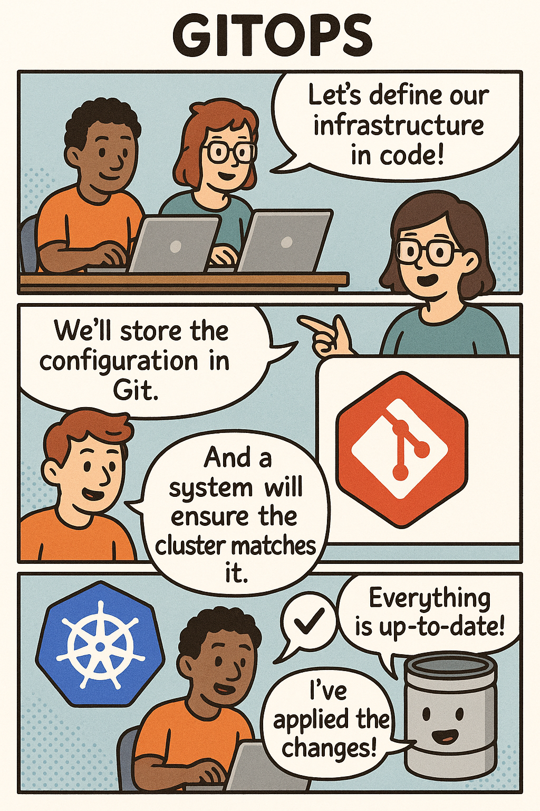
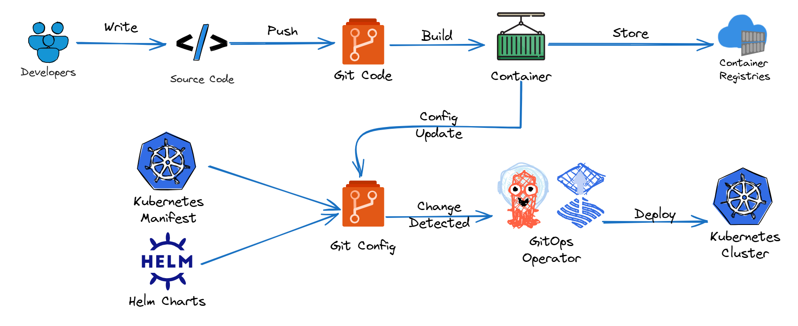
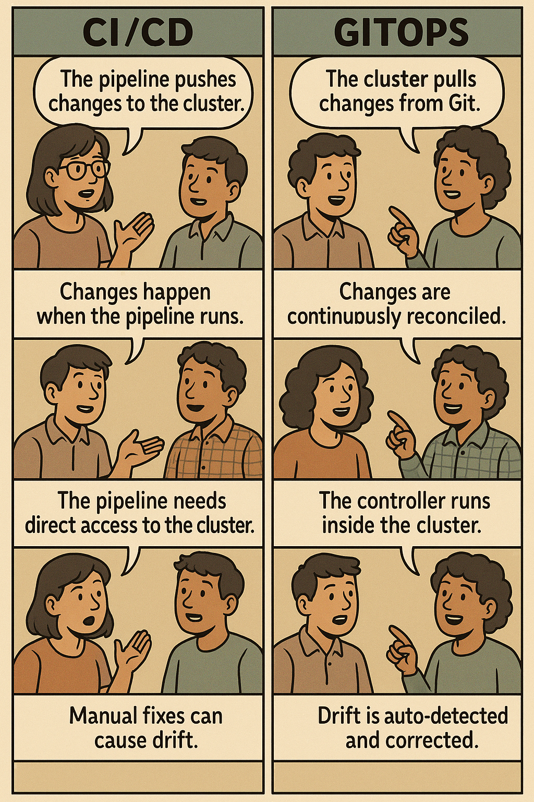
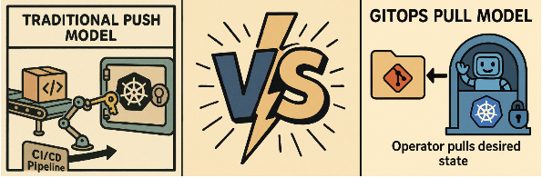
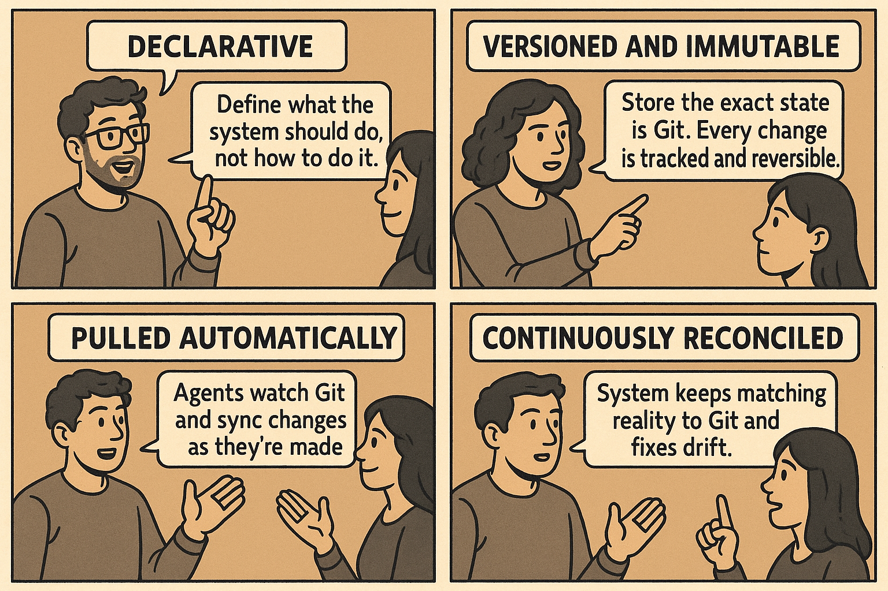

# 🌟 Day 1 – What really is GitOps?

If you’ve worked with Kubernetes for more than a few weeks, you’ve seen it:
what’s running in the cluster drifts away from what you thought was deployed.
A manual fix here, an emergency tweak there… and before long, the state in your cluster and the state in your Git repo tell two different stories.

That gap is where incidents start and trust in your deployments erodes.

Today we’re going to close that gap - permanently.
Not with more scripts or a bigger CI pipeline, but by changing **where** your source of truth lives and **how** your cluster keeps itself aligned with it.

By the end of this session, you’ll be able to:

* State GitOps in one clear sentence.
* Trace the Git → controller → cluster loop.
* Explain why pull beats push for Kubernetes - and why it changes the game for drift, security, and recovery.

Let’s start with the most important question: **what exactly is GitOps?**

## What exactly is GitOps?

So what *is* GitOps, really? Let’s start with how most teams try to fight drift - and why those fixes don’t quite close the gap.

You’ve probably seen this: configs stored in Git but applied manually, deployment scripts that push updates, or CI/CD pipelines that run after every commit. They help, sure, but they still leave a gap between what’s in your repo and what’s running in your cluster. Manual changes or external systems can sneak in, and that’s where drift and configuration rot take hold.

This isn’t just your team’s problem. Back in 2017, engineers at Weaveworks popularised a different way: treat Git as the single source of truth, and let the cluster enforce it for itself. The idea caught on quickly. Tools like Flux and Argo CD put it into practice, and the CNCF’s [OpenGitOps project](https://opengitops.dev) formalised the core principles so teams everywhere could work from the same playbook.

Put simply:

**GitOps means storing the desired state of your system in Git, and running a controller inside each cluster that continuously pulls that state and reconciles the cluster to match it.**

> If it’s not in Git, it shouldn’t exist in the cluster.
> If it’s in Git, the cluster should match it.

The loop is simple: declare your infrastructure as code, commit it to Git, the controller pulls and enforces it, and the cluster stays aligned automatically.

In practice, that looks like this:

1. You declare your infrastructure and application configs as code.
2. You commit the changes to Git - now it’s versioned and visible.
3. The in-cluster controller compares Git (desired) with the cluster (actual) and fixes any differences.
4. The cluster stays aligned, and drift never builds up.

Storing YAML in Git is a good first step. GitOps goes further - your cluster pulls from Git and enforces it, continuously. Let’s see what that changes.

## Beyond Just Storing YAML in Git

You might be thinking, *“Hang on - we already keep our manifests in Git. Isn’t that GitOps?”*
That’s a good start… but it’s not the whole story.

Here’s why: storing YAML in Git is like writing down the rules but never checking if anyone’s following them. Without something constantly making sure your cluster matches those files - and fixing it when it doesn’t - drift will sneak back in.

When you go from “YAML in Git” to **GitOps**, a few key things change:

* **Authority** - You (or a CI job) are no longer the one applying changes; an in-cluster controller does it, all the time, without forgetting.
* **Direction** - Instead of pushing changes into the cluster, the cluster pulls its own configuration from Git.
* **Timing** - Instead of waiting until you remember to run a command, reconciliation happens automatically on a short, predictable cycle.
* **Evidence** - Instead of ad-hoc CLI changes, every change leaves a commit and a review trail.

Here’s how that plays out:

You merge a PR that sets `replicas: 3`.
Later, someone bumps it to 5 by hand.
In the next reconciliation cycle, the controller spots the mismatch and sets it back to 3.
No Slack pings. No late-night debugging. If you *really* want 5, you change Git. If you need to undo a bad change, you revert the commit.

The takeaway?
YAML in Git tells you what *should* happen. GitOps makes sure it *does* happen - automatically, continuously, and without you chasing it.

## How the GitOps Engine Works

So far, we’ve been talking about *what* GitOps is. Let’s talk about *how* it actually works.

At the heart of GitOps is a small piece of software called a **GitOps controller** that runs inside your cluster. Its job is simple but relentless:

1. **Watch** your Git repository for changes.
2. **Compare** what’s in Git (desired state) with what’s running in the cluster (actual state).
3. **Reconcile** any differences by updating the cluster to match Git.

That’s it: **watch → compare → reconcile**.
This is the GitOps loop, and it runs continuously - on a short, predictable cycle - like a steady heartbeat keeping your cluster healthy.

Here’s what that means in real life:
If someone makes a direct change in the cluster - maybe tweaks an environment variable - the controller spots it in the next cycle and flips it back to match Git. No drama. No surprises. And no chasing down mysterious changes later.

With that foundation in place, we can look at how this loop shapes your day-to-day workflow.

## GitOps Workflows in Practice

Now that you understand *how* the GitOps engine works, let’s zoom out and see how it fits into your everyday workflow.

Here’s the big picture at a glance:

### The Two-Repository Pattern

In GitOps, we usually split work into two repos:

1. **Application repo** – Your source code, tests, and Dockerfiles.
2. **Configuration repo** – Your Kubernetes manifests, Helm charts, or Kustomize configs.

Why split them?
It keeps code changes and deployment settings independent. Developers focus on building and testing code. Platform teams focus on how and where it runs. Each can evolve separately, with its own review and approval process.

### From Commit to Cluster

Here’s what it looks like in motion:
You push code to the **application repo**.
CI picks it up, builds and tests it, creates a container image, and pushes that image to a registry.
Then - and this is the only deployment step CI does - it updates the **config repo** with the new image tag.

The GitOps controller, always watching the config repo, spots the change. It pulls the new config, applies it to the cluster, and if anything drifts later, it quietly puts things back in place.

### The Key Shift

Notice what never happens?
The CI pipeline never talks to your cluster. No API tokens floating around in external systems. No one-off manual kubectl commands.

The cluster follows what’s in Git, and only what’s in Git. That’s not just cleaner - it’s more secure, more auditable, and more reliable. If you want to change something, you change Git. If you want to undo something, you revert Git.

## GitOps vs Traditional CI/CD

You’ve seen how GitOps works inside a team’s workflow. But how does it stack up against the way most teams deploy today? Let’s put them side by side.

The difference comes down to who makes the change, and how it gets into your cluster.

### Push vs Pull at a Glance

| Aspect              | Traditional CI/CD                         | GitOps                                      |
| ------------------- | ----------------------------------------- | ------------------------------------------- |
| **Who deploys**     | CI pipeline pushes to cluster             | Controller inside cluster pulls from Git    |
| **Access model**    | External systems need cluster credentials | Only the in-cluster controller needs access |
| **When it happens** | On demand when the pipeline runs          | Continuously, on a short, regular cycle     |
| **Drift handling**  | Manual intervention required              | Automatically detected and fixed            |
| **Rollback**        | Re-run pipeline with an old version       | `git revert` and commit                     |
| **Audit trail**     | Spread across CI logs                     | All in Git history                          |
| **Source of truth** | Could be CI, could be the cluster         | Always Git                                  |

### Why the Pull Model Changes the Game

Security is one of the biggest wins.

In the push model:

* Anyone with CI credentials can make direct changes to your cluster.
* Those changes might leave minimal traces outside the CI system.
* Finding them later means digging through multiple systems.

In the pull model:

* Every change must go through Git.
* That means commits, branches, and file changes - all logged, reviewable, and easy to trace.
* Rolling back is as simple as reverting a commit.

Push model = a quiet side door.
Pull model = the front door, where everyone sees who’s coming and going.

### What This Means Day to Day

**Traditional CI/CD**: You run a pipeline and hope it finishes cleanly. Maybe the cluster updated. Maybe someone changed something in between.

**GitOps**: If it’s in Git, it’s in the cluster. If someone changes the cluster by hand, it’s corrected automatically in the next reconciliation cycle.

With GitOps, deployments aren’t one-off events. They’re a state your system actively maintains - secure, auditable, and resistant to drift.

## The Four Principles That Make GitOps Work

Everything you’ve seen today - the self-healing, the security, the simplicity - comes down to four core ideas. They’re not mine, and they’re not specific to Flux. The CNCF’s [OpenGitOps](https://opengitops.dev) project pulled these patterns from real-world teams and wrote them down so everyone is speaking the same language.

Here they are, plain and simple:

1. **Declarative** - Describe the end state you want, not the steps to get there. For example, `replicas: 3` instead of running `kubectl scale`.
2. **Versioned & Immutable** - Keep the desired state in Git, so every change is tracked, reviewed, and reversible.
3. **Pulled Automatically** - The cluster fetches its own configuration from Git - you never push changes into it.
4. **Continuously Reconciled** - The system keeps reality matched to Git and fixes drift whenever it appears.

If someone tells you they “do GitOps,” these are the four things you should be able to see in action. And when you use Flux, Argo CD, or other GitOps tools, this is exactly what they’re implementing for you.

## GitOps in Context: Your Journey Forward

### From Drift to Control

We began today with a simple truth: what’s in Git often drifts from what’s running in your cluster. Quick fixes, manual changes, and ad-hoc scripts make it worse.

Now you’ve seen the alternative — a model where Git is the single source of truth, and your cluster keeps itself aligned with it.

By the end of this first session, you can:

* Explain the GitOps loop: **watch → compare → reconcile**
* Show why **pull beats push** for security and reliability
* Identify the four CNCF-endorsed principles that make self-healing possible

### Tomorrow: From Knowledge to Power

Tomorrow we go from concept to action. In the next hour you will:

* **Build** a local Kubernetes cluster
* **Install** Flux and watch it take control
* **Deploy** an app using only Git commits
* **Break** something on purpose — and watch it heal itself

No cloud accounts. No complex setup. Just your laptop and the full GitOps loop in action.

And here’s the real win: with GitOps, drift isn’t something you scramble to detect - it’s something that simply can’t persist. Your clusters will sync themselves, your audit trail will live in Git, and your role will shift from firefighting to guiding intent.

By Day 5, you’ll be confident running GitOps in production - with the peace of mind that comes from knowing your system is always in the state you declared.

**Ready to build your first self-healing system?**
[Continue to Day 2 →](https://github.com/ahmedmuhi/GitOps-Days/blob/main/Day-2-Building-Your-First-Self-Healing-System.md)
