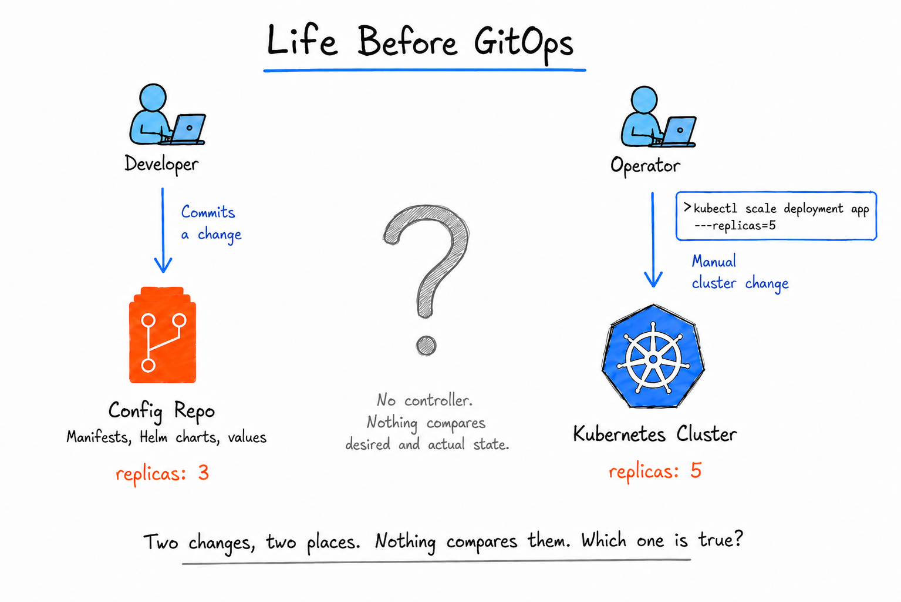
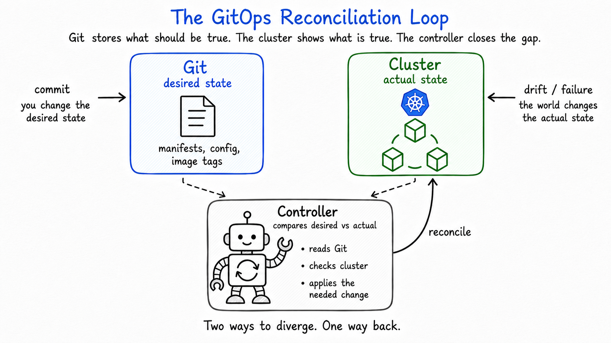
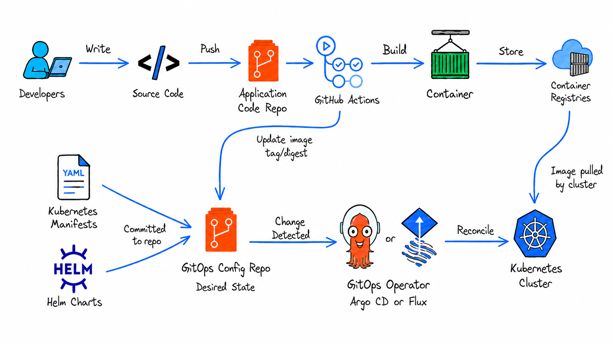

# Day 1: What really is GitOps?

## Life before GitOps

If you've run Kubernetes for any length of time, you've probably seen some version of this story.

A team runs an application in Kubernetes, with its deployment configuration stored in Git so changes can be reviewed, tracked, and rolled back. At the moment, that configuration declares three replicas:

```yaml
replicas: 3
```

Then an incident happens.

Traffic increases unexpectedly, and the application starts struggling. Someone on the team investigates and makes a quick operational decision to scale the Deployment to five replicas.

```bash
kubectl scale deployment app --replicas=5
```

The service stabilises. The immediate problem is solved.

**But the team has created a gap.**

<p align="center">
  
</p>

Git still says `replicas: 3`, while the cluster is now running `replicas: 5`.

Nothing about this situation is unusual. The original configuration was correct when it was committed, and the operational change was equally correct when it was made. The problem is that the two now describe different versions of the same system. Git describes what the team intends the system to look like, while the cluster reflects what it currently looks like. Nobody is continuously comparing the two.

This is configuration drift.

It rarely happens because people ignore good practices. More often, it happens because production systems change between deployments. An emergency fix is made, a setting is adjusted while troubleshooting, or a temporary workaround quietly becomes permanent. Over time, Git and the cluster drift apart because nothing is continuously checking whether they still agree.

Teams have tried to close this gap by storing configuration in Git, writing deployment scripts, and building CI pipelines that automatically apply changes. Each of those practices improves software delivery, but they all share the same blind spot: they act when a deployment happens. Between deployments, where real life happens, the cluster can continue changing while Git stands still.

In 2017, engineers at Weaveworks proposed a different operating model and gave it a name: **GitOps**.

Instead of treating Git as a record that humans occasionally consult, GitOps treats Git as the source of truth that the system continuously enforces.

**Store the desired state of the system in Git, and run a controller that continuously compares that desired state with the cluster and reconciles any difference.**

> [!IMPORTANT]
> If it's not in Git, it shouldn't exist in the cluster.
>
> If it's in Git, the cluster should eventually match it.

The controller does not decide whether three replicas or five replicas is the right answer. That decision still belongs to people. What changes is that there is now a mechanism continuously asking one question:

**Does the cluster still match Git?**

Everything else in GitOps follows from that question.

## Meet the GitOps controller

GitOps adds the missing component in our story: a controller.

A GitOps controller is software that runs in or alongside the Kubernetes environment and keeps the configuration stored in the cluster aligned with the desired state recorded in Git. Flux and Argo CD are two common implementations. They differ in how they are installed, configured, and operated, but they perform the same essential role: they watch Git and reconcile the cluster when its configuration no longer matches.

The controller does not decide what the system should look like. People still make that decision through commits, pull requests, and reviews. Nor does it build the application or run its tests. Its responsibility begins once the desired state has been recorded in Git.

From that point on, it keeps asking the question we ended with:

**Does the cluster still match Git?**

The controller answers that question through a continuous reconciliation loop.

<p align="center">
  
</p>

The diagram shows the complete relationship. Git holds the desired state that the team has reviewed and approved. Kubernetes holds the corresponding objects currently recorded in the cluster. The controller sits between them and repeatedly gathers both versions, compares them, and acts whenever they differ.

That routine has three parts: **watch, compare, and reconcile**.

During **watch**, the controller reads the desired configuration from Git and the corresponding objects from Kubernetes. During **compare**, it determines whether those two descriptions still agree. During **reconcile**, it applies the declared configuration when they do not.

Then it checks again.

The loop continues whether anyone is actively deploying or not. Most cycles find that Git and the cluster already agree, in which case the controller makes no change. When a difference appears, the same routine is what detects and corrects it.

The diagram gives us the whole mechanism at once. Now slow it down and follow one cycle from beginning to end.

## The loop, one cycle at a time

The opening left Git declaring three replicas while the cluster was running five. With the controller now running, that gap closes on its next pass: Git holds the decision, so the cluster returns to three. But the team still thinks five was the right call, and that is where a full cycle becomes worth following.

So they capture the decision properly. Someone opens a pull request with the one-line change, a teammate reviews it, and it is merged. Git now says `replicas: 5`, while the cluster is still running 3.

Now notice what has happened. The two states disagree again — but this time the direction of change is reversed. Previously, the cluster changed and Git stayed the same. Now Git changed and the cluster stayed the same: the desired state has moved, and the cluster hasn't caught up with it. The disagreement looks different, but to the controller it is exactly the same problem — desired ≠ actual — and it is about to respond through the three-part routine at the heart of the reconciliation loop: watch, compare, reconcile.

**Watch — gather both sides of reality.** The controller begins by collecting two snapshots. From Git, it reads the desired state: `replicas: 5`. This is what the system *should* look like. From the cluster, it reads the Deployment as currently recorded: `replicas: 3` — the actual state, as far as the controller can see. Nobody manually triggered this check — the reconciliation cycle was going to happen anyway. The merge didn't start the loop; it simply created a difference for the next cycle to discover. The controller now holds both sides of the picture: desired 5, actual 3.

**Compare — determine whether alignment exists.** Next, the controller compares the two snapshots. The Deployment is identical in every important way except one field: desired says 5, actual says 3. The result of Compare is a verdict — desired ≠ actual. That's all Compare produces. It only answers one question: are the two states aligned?

**Reconcile — move reality toward the declaration.** The answer is no, so the controller acts. It applies the declared Deployment with `replicas: 5`, and Kubernetes responds by creating two additional pods. The cluster moves from 3 to 5. Now compare this cycle with the drift correction earlier. Previous cycle: desired 3, actual 5 — the action was scale down. This cycle: desired 5, actual 3 — the action is scale up. The action changed direction. The rule did not. The controller always drives actual state toward desired state.

**Deployment and drift correction are the same thing.** This is the key idea. A deployment is reconciliation. Drift correction is reconciliation. The controller doesn't have separate logic for "a developer merged a feature," "someone changed the cluster manually," "a rollback was requested," or "an incident fix was committed." All of these become the same question: does the live system match the declared system? If yes, nothing happens. If no, the controller changes reality until they match.

**The loop continues.** After the replicas are updated, the next cycle begins. The controller checks again: desired 5, actual 5. The states match, so the controller makes no change — and that nothing is not inactivity, it's verification. The controller is continuously confirming that the system remains aligned. In a healthy GitOps environment, most cycles end with the controller watching both states, finding that desired and actual already match, and making no change. The loop is not a deployment event that runs only when someone pushes code. It's a continuous heartbeat that keeps asking: does reality still match the declaration?

Here's the sentence that makes the entire model predictable, and it's worth reading twice:

**To the reconciliation loop, a deliberate commit and a manual change reduce to the same condition: desired ≠ actual. The controller moves actual toward desired.**

The controller doesn't understand human intent. It doesn't know that this was an emergency fix, that was a planned feature, this was an accident, that was a rollback. It knows one thing: desired and actual are different. When they differ, it reconciles. The action may be scaling up after a Git change, scaling down after drift, deploying a new version, or restoring a previous one. The mechanism is always the same: **desired state governs actual state.**

That is the reconciliation loop.

## What the controller does — and what it leaves to others

By now, you might be giving the GitOps controller too much credit. It's easy to imagine the controller as the thing that manages everything: deploying applications, fixing failures, recreating pods, and keeping the whole platform healthy.

But that's not its job. To understand GitOps properly, you need to understand its boundaries. Knowing what the controller **does not** do is just as important as knowing what it does.

Start with something you saw in the previous cycle. The controller detected desired = 5 replicas, actual = 3 replicas, so it reconciled by applying the Deployment with `replicas: 5`. Then Kubernetes created the two missing pods.

Notice what did **not** happen. The GitOps controller did not create pods. It did not schedule containers. It did not choose nodes. It changed the desired definition, and Kubernetes handled everything below that.

That is the boundary.

### Kubernetes already has its own reconciliation loop

Kubernetes is itself a reconciliation system. When you declare a Deployment with `replicas: 5`, you're telling Kubernetes that the cluster should continuously maintain five running copies of the application. Kubernetes controllers then work continuously to make reality match that declaration.

- A pod crashes → the pod disappears → Kubernetes notices → a replacement pod is created.
- A node fails → the node disappears → Kubernetes detects missing workloads → pods are rescheduled elsewhere.

None of this requires GitOps. No Git commit, no pull request, no Flux, no Argo CD. Kubernetes has been doing this since long before GitOps existed.

### GitOps adds another reconciliation layer

So what does the GitOps controller add? One layer above Kubernetes. The simplest way to remember it:

**Kubernetes heals workloads. GitOps heals definitions. It's the same loop, one layer up.**

The two systems are solving different problems. Kubernetes keeps the objects inside the cluster running: it turns a Deployment into pods, and pods into containers. GitOps keeps those objects aligned with Git: it takes what the repository declares and makes the cluster's objects match.

Together they form two stacked reconciliation loops. Each loop has its own source of truth, its own desired state, its own responsibility. The GitOps controller watches Git. Kubernetes watches the cluster.

There is an important distinction here. The GitOps controller never looks at a pod. Not once.

When it reads the "actual state," it is not checking how many containers are running, whether pods are healthy, or which nodes are hosting workloads. Instead, it reads the Kubernetes objects stored in the cluster. It compares the Deployment definition in Git with the Deployment object currently stored in Kubernetes, and its question is a narrow one: does the cluster's declared configuration match what Git declares? Whether the five pods behind that Deployment are actually running is a different question entirely, and it belongs to Kubernetes.

This means "actual state" has a different meaning depending on which reconciliation loop you're talking about. For the GitOps controller, actual state is the configuration currently stored in Kubernetes. For Kubernetes, actual state is the workloads that are actually running.

The Kubernetes object sits between these two worlds. It is the actual state from the GitOps controller's perspective, but it becomes the desired state that Kubernetes tries to enforce. That handoff is the entire relationship between the two loops.

### Why some failures trigger GitOps and others do not

Return to our manual scaling. Someone changed the Deployment from `replicas: 3` to `replicas: 5`. The definition changed. Git still said 3, the cluster definition said 5. The disagreement existed at the GitOps layer, so the GitOps controller responded: Git ≠ cluster definition. It reconciled and restored the Deployment.

Now consider a different failure. It's 2 AM, a node crashes, and three pods disappear. What does the GitOps controller do?

Nothing.

Why? Because the Deployment still says `replicas: 5`, and Git still says `replicas: 5`. The definitions are aligned. And more than that — the controller never saw the crash at all. Pods are not something it reads. The problem existed below the GitOps layer, where Kubernetes notices that the Deployment requires five pods, only two exist, and repairs the situation itself.

Now change one detail. Someone deletes the Deployment itself.

This is different. The definition is gone. Git says the Deployment exists; the cluster says it's missing. Now the GitOps loop detects desired ≠ actual and restores the Deployment. Then Kubernetes sees a Deployment that exists with no pods behind it, and its own reconciliation loop creates them.

Two loops, two responsibilities, one recovery. This is what people mean when they say Kubernetes and GitOps provide self-healing behaviour: each system heals the part it owns. In the Day 2 lab, you'll trigger exactly this and watch both layers respond.

### What the controller does not decide

The boundary above the controller matters too. The GitOps controller enforces what Git declares. It does not decide what Git *should* declare. That decision belongs to humans and the delivery pipeline.

The controller does not decide whether a feature is good, review application code, choose replica counts, approve architecture changes, or determine whether an application is healthy. Those decisions happen before reconciliation. The controller simply enforces the result.

It also does not replace CI. The GitOps controller does not build container images, run unit tests, scan for vulnerabilities, or package applications. That's CI's responsibility — and we'll place that boundary precisely in the next section.

And it does not monitor whether your application is actually succeeding. It does not know whether users are happy, whether latency is acceptable, or whether the application is producing correct results. A cluster can be perfectly synchronised with Git and still running a terrible application. If Git declares "deploy the broken version," the controller's job is to deploy the broken version correctly.

### The complete boundary

The whole system can now be summarised in four layers:

**You decide. Git records. The controller enforces. Kubernetes runs.**

That narrow responsibility is exactly what makes the reconciliation loop predictable. The controller is not the system that does everything. It is the system that does one thing relentlessly: keep the cluster's declared state aligned with Git.

## GitOps workflows in practice

You now understand what the GitOps controller does and, just as importantly, what it does not do. But that leaves an important practical question: if the controller only reconciles what Git declares, who puts changes into Git in the first place?

To answer that, follow one change from beginning to end — from a developer writing code, all the way to new pods running in Kubernetes.

### Two repositories, two responsibilities

Most GitOps implementations separate application code from deployment configuration by using two repositories.

The first is the **application repository**. This is where developers work. It contains the source code, the tests, the dependencies, and the Dockerfile used to build container images.

The second is the **configuration repository**. This contains the Kubernetes manifests, Helm charts, and values files that describe the desired state of the environment. This is the repository watched by the GitOps controller.

Why separate them? Because application code and infrastructure configuration change for different reasons and at different speeds. A developer adding a new feature shouldn't need to modify production deployment settings. A platform engineer changing CPU limits or scaling rules shouldn't need to touch application source code. Keeping them separate gives each repository its own history, review process, ownership, and lifecycle.

<p align="center"></p>

### From commit to cluster

Now follow a normal application change.

A developer writes code and pushes it to the application repository. At this point, CI takes over: the pipeline builds the application, runs the automated tests, creates a container image, and pushes that image to a container registry.

Then CI does one more thing, and it's the important one. It updates the configuration repository with the new image reference — changing, say, `image: payments:v1.2` to `image: payments:v1.3`.

That commit is the handoff point. And this is where CI stops.

CI does **not** connect directly to the Kubernetes cluster. It does **not** run `kubectl apply`. It does **not** need production cluster credentials. Its responsibility is complete once the desired state has been updated in Git.

### The controller takes over

From here, the process is the same reconciliation loop you've already seen.

The GitOps controller checks the configuration repository during its next cycle and finds that Git now declares a new image version. The cluster's stored Deployment still declares the previous one. The two states do not match — desired: new image, actual: old image — so the controller reconciles. It applies the updated Deployment configuration.

Kubernetes then performs the rollout. It creates new pods using the updated image, pulls that image from the container registry, and gradually replaces the old pods according to the rollout strategy.

Notice the division of responsibilities. The GitOps controller changes the Deployment definition. Kubernetes manages the running workload. The container registry stores the image. Each component does the part it owns.

### The handoff is a Git commit

The most important connection between CI and GitOps is surprisingly simple: a Git commit.

CI writes to the configuration repository. The GitOps controller reads from the configuration repository. Neither system needs to call the other directly. Neither system needs access to the other's environment. The repository itself becomes the boundary between them.

This separation is one of the defining ideas behind GitOps: the single front door.

Traditional deployment pipelines usually work by pushing changes directly into the cluster. The pipeline holds cluster credentials and executes deployment commands. That creates a direct path into production — anyone who can modify the pipeline can potentially modify the environment.

GitOps changes this model. The cluster does not accept changes pushed from outside. It trusts exactly one source: the configuration repository. The controller continuously watches that repository and brings the cluster into alignment with it.

Every production change now has a visible history. Someone changed a file. A commit was created. A review happened. The controller reconciled it. The path into production is no longer a hidden deployment command — it's a Git change that can be inspected, reviewed, and reverted.

### The complete flow

The full story, end to end: a developer changes application code. CI builds and tests that code, creates an image, and records the new version in the configuration repository. The GitOps controller notices the change and updates Kubernetes. Kubernetes runs the new workload.

The only thing passed between these systems is the desired state stored in Git.

**CI creates the artifact. Git records the desired state. The controller enforces it. Kubernetes runs it.**

## Where GitOps fits alongside CI

A common worry at this point: does GitOps replace our CI pipeline?

No. It replaces the part that comes after.

Most teams run a pipeline that does everything — build, test, scan, deploy. GitOps draws a line through that sequence. Everything before the line stays exactly as it is. Everything after it changes hands.

| Responsibility | CI | GitOps controller |
| --- | --- | --- |
| Build and compile code | ✓ | |
| Run tests | ✓ | |
| Scan images for vulnerabilities | ✓ | |
| Push image to registry | ✓ | |
| Update config repo with new tag | ✓ | |
| Detect configuration changes | | ✓ |
| Apply changes to the cluster | | ✓ |
| Correct drift | | ✓ |
| Maintain continuous reconciliation | | ✓ |

Notice there's no overlap. That's not an accident — it's the whole design. CI has no credentials to your cluster. The controller has no role in building or testing. The configuration repository is the contract between them, and it's the only thing they share.

So GitOps doesn't ask you to throw out your pipeline. It asks you to stop it one step earlier — before it touches the cluster — and let the controller take it from there.

## The four principles, named

Everything you've seen today has a formal name. The CNCF's [OpenGitOps project](https://opengitops.dev) distilled what teams practising GitOps had in common into four principles. You've already watched each one in action — here's what the community calls them.

**1. Declarative.** You describe the end state, not the steps to reach it. When the manifest said `replicas: 3`, nobody told Kubernetes *how* to create three pods. The declaration was the instruction.

**2. Versioned and immutable.** Every change lives in Git — committed, reviewed, reversible. When the emergency scale to five turned out to be right, it didn't stay a live edit. It became a pull request, with a reviewer and a history. That's the difference between a change that happened and a change anyone can find later.

**3. Pulled automatically.** The cluster fetches its own configuration. Nobody deployed the new replica count — no pipeline ran, no one clicked anything. The controller pulled the change on its next cycle. This is also why CI never needed cluster credentials.

**4. Continuously reconciled.** The loop doesn't stop. It corrected the manual scale, applied the merged PR, restored a deleted Deployment, and — most of the time — found that desired already equalled actual and did nothing at all. That last case is the principle working, not resting.

If someone tells you they "do GitOps," these four are what you should be able to see. If a tool claims to be GitOps-compliant, these are the boxes it needs to tick. And if something about an approach feels off, check it against these — the gap usually names the missing principle.

## What's next — on to Day 2

That's the mental model. Look at what you can now do with it.

Someone scales a Deployment by hand — you know it comes back, and why. A node dies at 2 AM — you know the GitOps controller sleeps through it, and which loop wakes instead. Someone deletes a namespace — you know both loops fire, in order. A pipeline pushes a new image tag — you know it's the same reconciliation as everything else, just with a different author.

That is the mental model you have built: you can now predict what the controller will do before you have ever used one.

Tomorrow you find out whether you were right.

In Day 2, you'll build this on your laptop:

- **Spin up** a local Kubernetes cluster with kind.
- **Install Flux** and point it at a Git repository.
- **Deploy an app** by committing a manifest — no `kubectl apply`.
- **Break it on purpose** — and watch the loop put it back.

Every prediction you just made is testable in about an hour.

**Ready to build it?** [Continue to Day 2 →](./Day-2-Building-Your-First-Self-Healing-System.md)
