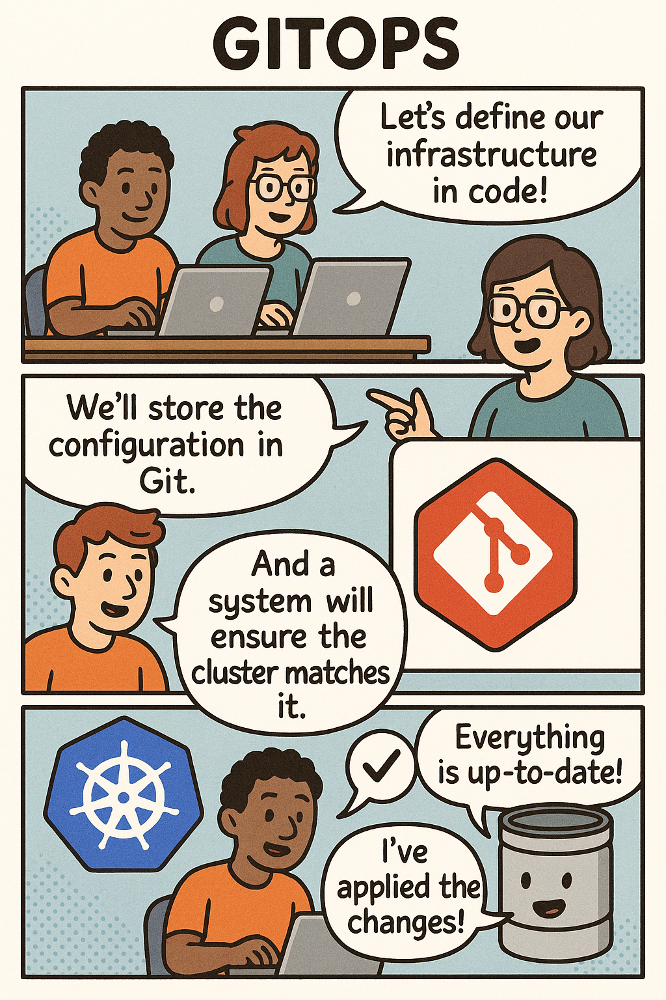
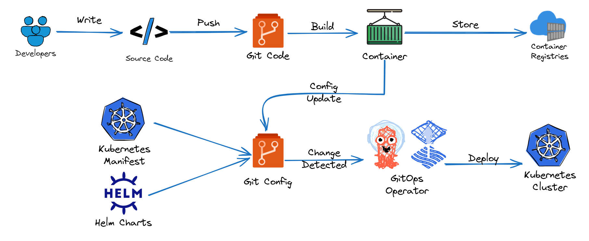
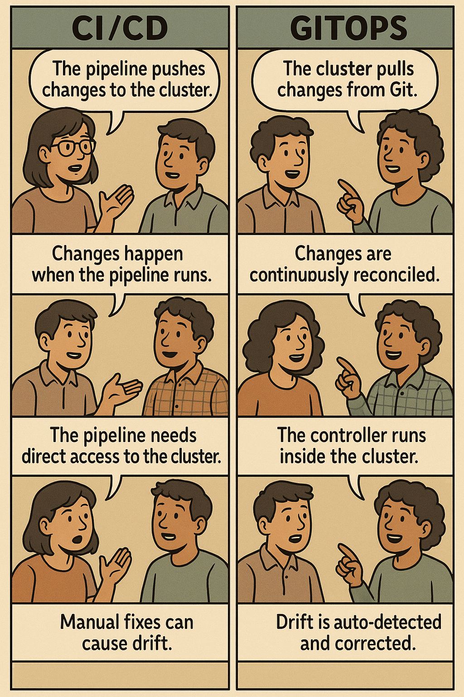
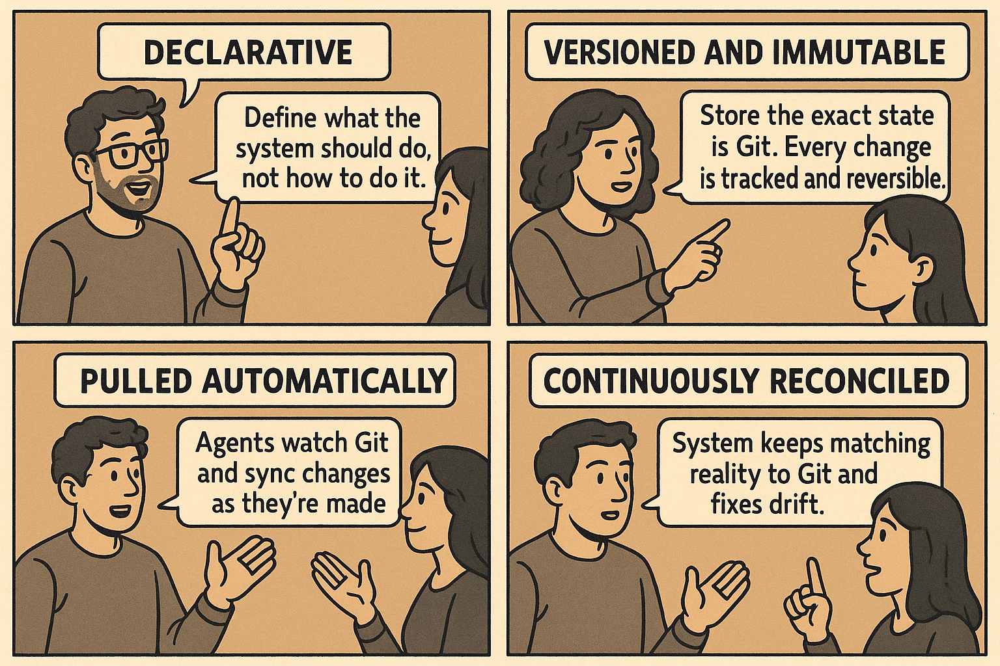

# Day 1 – What really is GitOps?

> **No tools needed today.** This is all mental model — by the end, you'll be able to predict what a GitOps controller does before you've ever touched one.

Let's get straight into it.

By the end of this session, you'll be able to:

- State GitOps in one clear sentence.
- Trace the reconciliation loop — watch, compare, reconcile — and explain what happens at each step.
- Explain why pull beats push for Kubernetes, and what that changes for drift, security, and recovery.
- Name the four CNCF principles and recognise them in action.

## The idea — and the loop behind it

If you've used Kubernetes for any length of time, you've seen drift — what's running in the cluster quietly diverges from what you thought was deployed. A manual fix here, an emergency tweak there, and before long your cluster and your repo tell two different stories.

Teams have tried to close that gap. Configs in Git, deployment scripts, CI pipelines that run on every commit. They help, but they still leave a window: manual changes or external systems can sneak in between pipeline runs, and that's where configuration rot takes hold.

In 2017, engineers at Weaveworks proposed a different approach: instead of pushing changes into the cluster, let the cluster pull its own configuration from Git — and enforce it continuously. The idea gained traction quickly. Tools like Flux and Argo CD put it into practice, and the CNCF's [OpenGitOps project](https://opengitops.dev) formalised the core principles so teams everywhere could work from the same playbook.

The result is a single idea:

**GitOps means storing the desired state of your system in Git, and running a controller inside the cluster that continuously pulls that state and reconciles the cluster to match it.**

> If it's not in Git, it shouldn't exist in the cluster.
> If it's in Git, the cluster should match it.

That controller follows a loop — and it's worth naming it now, because everything else in this series builds on it:

**Watch → Compare → Reconcile**

- **Watch** — the controller monitors your Git repository for changes.
- **Compare** — it checks what Git says (desired state) against what's actually running in the cluster (actual state).
- **Reconcile** — if there's a difference, it updates the cluster to match Git.

That's the **reconciliation loop**. It runs continuously on a short, predictable cycle — like a heartbeat keeping your cluster aligned. When we refer to "the loop" from here on, this is what we mean.

## Beyond just storing YAML in Git

You might be thinking, *"Hang on — we already keep our manifests in Git. Isn't that GitOps?"*

It's a fair question. Most teams do store their Kubernetes configs in Git, and that's a good habit. But here's the thing: storing YAML in Git is like writing down the rules and never checking if anyone's following them.

The missing piece is a **controller**.

Without one, your Git repo is a record — a place where intentions are documented but never enforced. Changes might get applied by a script, a pipeline, or someone running `kubectl apply` from their laptop. And between those moments, anything can happen. Someone edits a resource directly. A quick fix goes in and never makes it back to Git. The cluster drifts, and your repo doesn't know about it.

Add a controller, and everything shifts.

YAML in Git without a controller is a record.
YAML in Git *with* a controller is a **system**.

That one addition — software running inside the cluster, watching Git and acting on what it finds — changes four things at once:

**Authority** moves from you to the controller. You're no longer the one applying changes, remembering to run commands, or hoping the pipeline caught everything. The controller does it, every cycle, without forgetting.

**Direction** reverses. Instead of pushing changes into the cluster from the outside, the cluster pulls its own configuration from Git. Nothing external needs access to your cluster's API.

**Timing** becomes continuous. Instead of changes landing whenever someone triggers a pipeline or runs a command, reconciliation happens automatically on a short, predictable cycle. Drift doesn't get a chance to accumulate.

**Evidence** becomes complete. Every change flows through Git — commits, branches, pull requests, reviews. There are no side doors. If something changed, you can trace exactly when, why, and who.

Here's what that looks like in practice:

You merge a PR that sets `replicas: 3`.
Later, someone bumps it to 5 by hand.
In the next reconciliation cycle, the controller spots the mismatch and sets it back to 3.
No Slack pings. No late-night debugging. If you *really* want 5 replicas, you change Git. If you need to undo a bad change, you revert the commit.

That's the line between "we store YAML in Git" and "we do GitOps." The YAML was never the point — the enforcement is.

## The reconciliation loop in detail

You've seen what the loop does. Now let's open it up and watch one full cycle happen.

Imagine you have a Git repo containing a Kubernetes Deployment manifest. It declares a simple nginx pod with `replicas: 3` and an image tag of `nginx:1.25`. The GitOps controller — let's say Flux — is installed in your cluster and pointed at that repo.

Here's what one cycle looks like:

### Watch

The controller polls your Git repository on a regular interval — typically every few minutes. It's not waiting for you to trigger anything. It checks whether the repo has changed since the last time it looked.

This time, it finds a new commit. You updated the image tag from `nginx:1.25` to `nginx:1.26`.

### Compare

The controller now holds two pictures of reality:

- **Desired state** — what Git says: `nginx:1.26`, three replicas.
- **Actual state** — what's running in the cluster: `nginx:1.25`, three replicas.

It compares them field by field. Replicas match. Image tag doesn't.

### Reconcile

The controller applies the difference. It updates the Deployment in the cluster to use `nginx:1.26`. Kubernetes does what it always does — rolls out new pods, drains the old ones.

No pipeline triggered this. No one ran `kubectl apply`. The cluster saw the intent in Git and acted on it.

### And then it keeps going

This is the part that separates GitOps from a one-time sync. The cycle doesn't stop after one successful reconciliation — it starts again. The controller polls Git again. Compares again. If everything matches, it does nothing. If something has drifted — say someone manually scaled the Deployment to 5 replicas — it corrects it on the next pass.

That's why we called it a heartbeat in the previous section. It's not a deployment event. It's a continuous process. The cluster is never more than one cycle away from matching Git.

### What the controller doesn't do

It's worth being clear about boundaries. The controller reconciles what's declared in Git. It doesn't make decisions about *what should be* in Git — that's your job, through commits and pull requests. It doesn't build images, run tests, or manage CI. It has one responsibility: make the cluster match Git, and keep it that way.

This separation is what makes the model clean. You think, Git records, the controller enforces.

## GitOps workflows in practice

You now know what the controller does — and what it doesn't. So where does the rest of the work happen? Let's zoom out and see how the full workflow fits together.

### The two-repository pattern

In GitOps, work is typically split across two repositories:

1. **Application repo** — your source code, tests, and Dockerfiles. This is where developers build.
2. **Configuration repo** — your Kubernetes manifests, Helm charts, or Kustomize configs. This is what the controller watches.

Why split them? Because code changes and deployment configuration have different lifecycles. A developer shipping a new feature shouldn't need to touch infrastructure config. A platform engineer tuning resource limits shouldn't need to rebuild the application. Each repo has its own review process, its own history, and its own pace.

### From commit to cluster

Here's how a change flows through the system:

You push code to the **application repo**. CI picks it up — builds the code, runs the tests, creates a container image, and pushes that image to a registry. Then CI does one more thing: it updates the **configuration repo** with the new image tag.

That's where CI's job ends.

The controller, watching the configuration repo, picks up the change on its next cycle. It compares, finds the new image tag, and reconciles the cluster to match. The loop handles the rest.

### The key shift

Notice what never happens in this flow: the CI pipeline never talks to your cluster. It has no credentials, no API access, no direct connection. It writes to Git, and that's it.

The cluster only trusts one source — the configuration repo. Everything else is outside the wall.

This is the "front door" principle. In a traditional push model, CI has a side door straight into your cluster — anyone with pipeline credentials can deploy. In GitOps, there's only the front door: Git. Every change is visible, reviewable, and reversible before it ever reaches the cluster.

## Where GitOps fits alongside CI

If you're wondering whether GitOps replaces your CI pipeline — it doesn't. It replaces the part that comes after.

Most teams today run a pipeline that does everything: build the code, run the tests, scan the image, and then deploy it to the cluster. GitOps draws a line through that sequence. Everything before the line stays. Everything after it changes.

**CI builds and validates.** It compiles your code, runs your test suite, scans for vulnerabilities, builds the container image, pushes it to a registry, and updates the configuration repo with the new image tag.

**GitOps deploys and enforces.** The controller picks up the change from the configuration repo, reconciles the cluster, and keeps it aligned from that point forward.

They meet at one point: **the configuration repo.** That's the handoff. CI writes to it. The controller reads from it. Neither crosses into the other's territory.

Here's what that boundary looks like in practice:

| Responsibility | CI | GitOps controller |
| --- | --- | --- |
| Build and compile code | ✓ | |
| Run tests | ✓ | |
| Scan images for vulnerabilities | ✓ | |
| Push image to registry | ✓ | |
| Update config repo with new tag | ✓ | |
| Detect config changes | | ✓ |
| Apply changes to cluster | | ✓ |
| Correct drift | | ✓ |
| Maintain continuous reconciliation | | ✓ |

Notice there's no overlap. That's by design. CI has no credentials to the cluster. The controller has no role in building or testing. Each system does one job well, and the config repo is the contract between them.

This is why GitOps doesn't ask you to throw out your existing pipeline. It asks you to stop it one step earlier — before it touches the cluster — and let the controller handle the rest.

## The four principles — named

Everything you've seen today has a formal name. The CNCF's [OpenGitOps project](https://opengitops.dev) distilled the patterns that teams like Weaveworks, Flux, and Argo CD had been practising into four core principles. You've already seen each one in action — here's what the community calls them.

**1. Declarative**
You describe the end state, not the steps to get there. When you wrote `replicas: 3`, you didn't tell Kubernetes *how* to create three pods — you told it *what you wanted*. The system figured out the rest.

**2. Versioned and immutable**
Every change lives in Git — committed, reviewed, and reversible. When we said "if you want to undo a bad change, you revert the commit," that's this principle at work. Git is the single source of truth, and its history can't be quietly rewritten.

**3. Pulled automatically**
The cluster fetches its own configuration from Git. Nothing pushes in from the outside. This is the direction reversal you saw in section three — and the reason CI never needs credentials to your cluster.

**4. Continuously reconciled**
The loop doesn't stop. Watch, compare, reconcile — on every cycle, the controller checks for drift and corrects it. This is the heartbeat that makes self-healing possible.

If someone tells you they "do GitOps," these are the four things you should be able to see in action. If a tool claims to be GitOps-compliant, these are the four boxes it needs to tick. And if you're ever evaluating an approach and something feels off, check it against these — the gap will usually point you to which principle is missing.

## What's next — on to Day 2

At this point you might be thinking: this all sounds great, but how much setup pain am I signing up for?

Less than you'd expect.

In Day 2, you'll take everything from today's mental model and make it real — on your laptop, with no cloud accounts and no complex infrastructure. Here's what you'll do:

- **Spin up** a local Kubernetes cluster using kind.
- **Install Flux** and point it at a Git repository.
- **Deploy an app** by committing a manifest — no `kubectl apply`.
- **Break something on purpose** — and watch the reconciliation loop put it back.

By the end, you'll have a working self-healing system running locally. The loop you've been reading about will be running in front of you.

**Ready to build it?** [Continue to Day 2 →](./Day-2-Building-Your-First-Self-Healing-System.md)