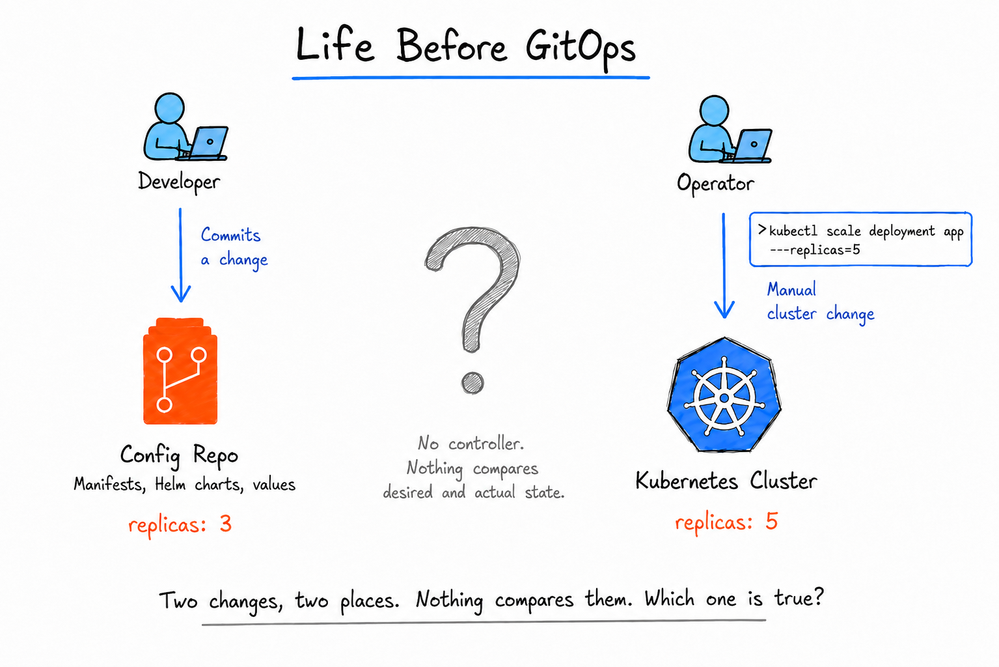
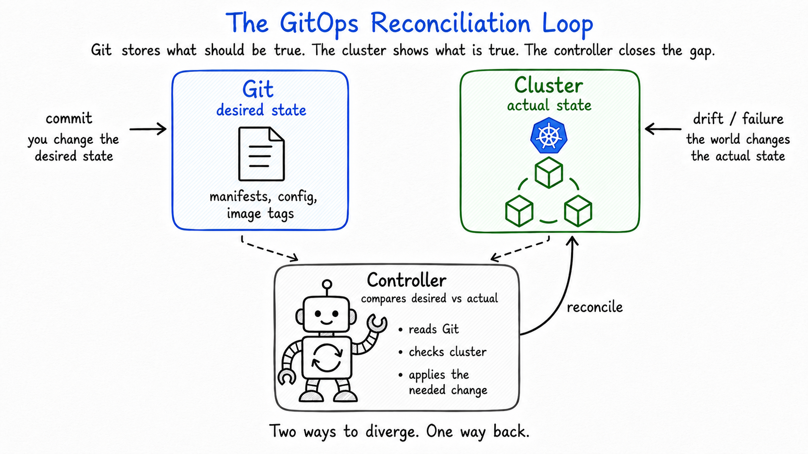
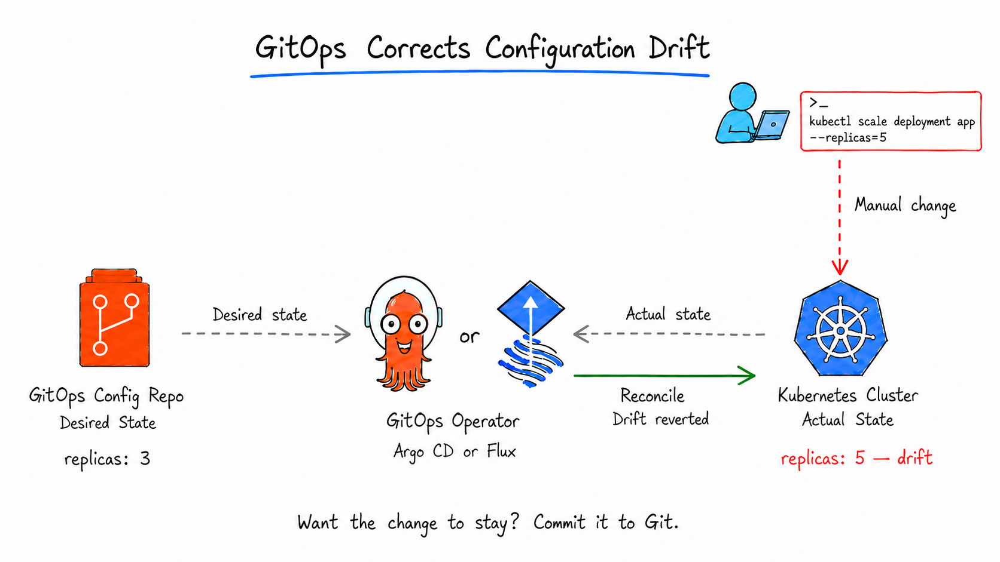
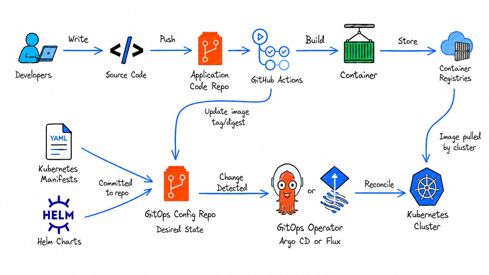

# Day 1 – What really is GitOps?

> **What you'll need:** Nothing — no cluster, no tools, no terminal.
> **Time:** ~30 minutes.
> **What you'll get:** By the end, you'll be able to predict what a GitOps controller does before you've ever touched one.

## Life before GitOps

If you've run Kubernetes for any length of time, you've probably seen some version of this story.

Your deployment manifests live in Git, because that's good practice — changes get reviewed, tracked, and rolled back. At the moment, they declare that the application should run three replicas:

```yaml
replicas: 3
```

Then an incident happens.

Traffic climbs faster than anyone expected, and the application starts struggling. Someone on the team investigates, makes a judgement call, and scales the Deployment directly:

```bash
kubectl scale deployment app --replicas=5
```

The service stabilises. The immediate problem is solved. Everyone moves on.

**But the team has created a gap.**

<p align="center">
  
</p>

Git still says `replicas: 3`, while the cluster is now running `replicas: 5`.

Nothing here is unusual, and neither change is wrong. The original configuration was correct when it was committed. The operational change was correct when it was made. The problem is that the two now describe different versions of the same system: Git describes what the team intends, the cluster reflects what is actually running, and nobody is continuously comparing them.

This is **configuration drift**.

It rarely happens because people ignore good practices. It happens because production systems change between deployments — an emergency fix, a setting adjusted while troubleshooting, a temporary workaround that quietly becomes permanent. One reasonable change at a time, the repo becomes a well-organised work of fiction, and the only way to know what's actually running is to go and look.

Teams have tried to close this gap by storing configuration in Git, writing deployment scripts, and building CI pipelines that apply changes automatically. Each of those practices improves software delivery, but they share the same blind spot: they act when a deployment happens. A pipeline that only runs on commit cannot notice a change that never involved a commit. Between deployments, where real life happens, the cluster keeps changing while Git stands still.

In 2017, engineers at Weaveworks proposed a different operating model and gave it a name: **GitOps**.

Instead of treating Git as a record that humans occasionally consult, GitOps treats Git as the source of truth that the system continuously enforces.

**Store the desired state of your system in Git, and run a controller that continuously pulls that state, compares it with the cluster's current configuration, and reconciles any difference.**

> If it's not in Git, it shouldn't exist in the cluster.
>
> If it's in Git, the cluster should eventually match it.

That is the controller's entire job. It does not decide whether three replicas or five is the right number for your application — that decision still belongs to people, in commits and reviews. What changes is that the decision now has to be recorded in Git, and that one question gets asked continuously:

**Does the cluster still match Git?**

Everything else in GitOps follows from that question.

## The controller and its loop

Asking that question, over and over, is the job of a **GitOps controller**. Flux and Argo CD are the two common implementations. They differ in how they are installed, configured, and operated, but they perform the same essential role: they watch Git and reconcile the cluster when its configuration no longer matches.

They do it through a continuous reconciliation loop.

<p align="center">
  
</p>

The diagram above shows the complete relationship. Git holds the desired state that the team has reviewed and approved. Kubernetes holds the corresponding objects currently recorded in the cluster. The controller sits between them and repeatedly gathers both versions, compares them, and acts whenever they differ.

That routine has three parts: **watch, compare, and reconcile**.

During **watch**, the controller reads the desired configuration from Git and the corresponding objects from Kubernetes. During **compare**, it determines whether those two descriptions still agree. During **reconcile**, it applies the declared configuration when they do not.

Then it checks again.

The loop continues whether anyone is actively deploying or not. Most cycles find that Git and the cluster already agree, so the controller makes no change at all.

Eventually, though, the answer is different.

## When Git and the cluster disagree

In our story, the operator scaled the Deployment to five, the service stabilised, and everyone moved on. Without a controller, the gap between the three declared in Git and the five running in the cluster simply persists. Nothing closes it, because nothing is looking for it.

Give that same team a controller and change nothing else, and the gap closes on its own within about a minute.

<p align="center">
  
</p>

The controller reads both sides and reaches a simple conclusion: they do not match. That is all it needs to know. It does not know there was a traffic spike. It does not know who ran `kubectl scale`, or whether the change was an emergency fix or a mistake. It knows that Git declares three replicas and the cluster declares five, so it applies the Deployment stored in Git, and Kubernetes scales the application back to three.

This is the point where GitOps starts to feel like it's working against you. A piece of software has just reverted a change that was working, on a service that needed it, without knowing why the change was made. From the operator's chair that looks less like a safety net and more like losing the ability to fix your own system.

So look at what the controller actually took away. Not the ability to run the command: `kubectl scale` still worked, and the service still stabilised when it mattered. What the controller removed is that change's ability to survive on its own. If five replicas really is the right number, the answer is not to run the command a second time. It is to spend a minute on a one-line pull request. From the next cycle onward, the controller will defend five exactly as stubbornly as it just defended three.

That is the shift. Authority no longer belongs to whoever touched the cluster most recently. It belongs to whatever Git declares. The controller is not protecting three replicas — today Git happens to say three, tomorrow it might say five, and it will enforce either one with the same indifference. And because it compares rather than negotiates, the disagreement was settled without a meeting and without anyone needing to remember who had the last word.

Which is the whole difference between the two worlds you've now seen.

YAML in Git without a controller is a **record**.

YAML in Git with a controller is a **system**.

## The loop, one cycle at a time

The team did exactly that. Someone opened the one-line pull request, a teammate reviewed it, and it was merged. Git now declares five replicas.

The cluster, meanwhile, is running three — the controller put it there a few minutes ago, when it corrected the drift.

So Git and the cluster disagree again. But look at the direction. Last time, the cluster moved and Git stood still. This time, Git has moved and the cluster hasn't caught up. From the outside, these are opposite situations: one was an accident being corrected, the other is a decision waiting to be applied. To the controller, they are indistinguishable. Here is the same three-part routine, running against the same numbers in reverse.

**Watch.** The controller collects two snapshots. From Git, the desired state: `replicas: 5`. From the cluster, the Deployment as currently recorded: `replicas: 3`. Nobody triggered this check. The cycle was going to happen anyway — the merge didn't start the loop, it simply created a difference for the next pass to find.

**Compare.** The two snapshots are identical in every field but one. Desired says five, actual says three. That verdict is the whole output of this phase. It answers one question — are the two states aligned? — and nothing more.

**Reconcile.** The answer is no, so the controller applies the Deployment declared in Git. Kubernetes creates two more pods, and the cluster moves from three to five.

Now put the two cycles side by side. Earlier: desired three, actual five, action scale down. Now: desired five, actual three, action scale up. The action reversed. The rule didn't. The controller drives actual toward desired, whichever way that happens to point.

**A deployment is reconciliation. Drift correction is reconciliation.** The controller has no separate logic for "a developer merged a feature," "someone changed the cluster by hand," "a rollback was requested," or "an incident fix was committed." Each one arrives as the same question: does the cluster match Git? If yes, nothing happens. If no, the controller changes the cluster until it does.

Here's the sentence that makes the entire model predictable, and it's worth reading twice:

**To the reconciliation loop, a deliberate commit and a manual change reduce to the same condition: desired ≠ actual. The controller moves actual toward desired.**

Then the next cycle begins. Desired five, actual five. The states match, so the controller does nothing — and that nothing is not idleness, it's confirmation. Most cycles end exactly this way, and a loop that spends most of its passes finding nothing to fix is a loop doing its job.

## What the controller does — and what it leaves to others

By now there's a risk you're giving the controller too much credit. It corrects drift, it applies deployments, it never sleeps — it would be easy to picture it as the thing that keeps the whole platform healthy.

It isn't, and knowing where it stops is as important as knowing what it does.

Look again at the cycle you just followed. The controller found desired five, actual three, and applied the Deployment declaring five. Then two more pods appeared. But notice who created them. The controller didn't. It didn't schedule containers, didn't choose nodes, didn't pull an image. It changed one definition, and something else did all the work underneath.

That something else is Kubernetes, and it has a reconciliation loop of its own.

### Kubernetes was already reconciling before GitOps existed

When you declare a Deployment with five replicas, you are telling Kubernetes to maintain five running copies of the application continuously. Its controllers then work to make reality match that declaration. A pod crashes, Kubernetes notices the shortfall, a replacement is created. A node fails, the workloads on it disappear, Kubernetes reschedules them elsewhere.

None of that needs Git, a commit, a pull request, Flux, or Argo CD. Kubernetes has been doing it since long before GitOps had a name.

So the GitOps controller adds one layer above a system that was already self-correcting. The two are solving different problems: Kubernetes keeps the objects in the cluster running, turning a Deployment into pods and pods into containers, while GitOps keeps those objects matching Git. **Kubernetes heals workloads. GitOps heals definitions.** The same loop, one layer up.

### The object in the middle

Which leads to the sentence that surprises most people learning this: the GitOps controller never looks at a pod. Not once.

When it reads the actual state, it is not counting containers, checking whether pods are healthy, or asking which nodes are hosting them. It reads the Kubernetes objects stored in the cluster, and it compares the Deployment definition in Git against the Deployment object recorded in the API. That's the whole comparison. Whether the five pods behind that Deployment are actually running is a different question, and it belongs to a different loop.

So "actual state" means two different things depending on which loop you're standing in. For the GitOps controller, actual state is the configuration recorded in Kubernetes. For Kubernetes, actual state is the workloads that are really running.

The Kubernetes object sits between the two worlds and plays both parts. To the GitOps controller above it, it is the actual state to be corrected. To Kubernetes below it, it is the desired state to be enforced. The object even keeps the two apart in its own fields: `spec` holds what was declared, and `status` reports what is currently true. The GitOps controller compares `spec` with Git. Kubernetes compares `status` with `spec`.

That handoff is the entire relationship between the two loops.

<p align="center">
  
</p>

### Why some failures reach GitOps and others never do

This is what makes the model predictable, so it's worth testing against three failures.

Return to the manual scale first. Someone changed the Deployment from three replicas to five, so the *definition* changed. Git said three, the object said five, and the disagreement sat exactly on the GitOps boundary. The controller saw it and reconciled.

Now a node fails, and three of the five pods disappear. What does the GitOps controller do? Nothing at all. Git declares five, the object declares five, and those two still agree — that's the state in the diagram above. The shortfall is real, but it lives in `status`, on the far side of a boundary the controller doesn't read. It never saw the crash. Below it, Kubernetes compares five against two and rebuilds the missing pods itself.

Now change one detail: someone deletes the Deployment. This time the definition is gone. Git says the Deployment exists, the cluster says it doesn't, so the GitOps loop reconciles and restores it. Kubernetes then finds a Deployment with no pods behind it and creates them.

Two loops, two responsibilities, one recovery. That is what people mean when they say GitOps and Kubernetes give you self-healing: each system heals the part it owns. In the Day 2 lab, you'll break things in both directions and watch the layers respond.

### What the controller does not decide

The boundary above the controller matters too.

The controller enforces what Git declares. It does not decide what Git *should* declare — not whether a feature is ready, not whether the replica count is sensible, not whether an architecture is sound. Those decisions happen before reconciliation, in commits and reviews, and the controller simply carries out the result.

It also doesn't build anything. Images, tests, vulnerability scans, packaging — none of that is its work, and we'll place that line precisely in a moment.

And it has no opinion on whether your application is any good. It doesn't know if users are happy, if latency is acceptable, if the results are correct. A cluster can be perfectly synchronised with Git and running something terrible. If Git declares the broken version, the controller's job is to deploy the broken version faithfully.

### The complete boundary

Which gives you the whole system in four steps:

**You decide. Git records. The controller enforces. Kubernetes runs.**

That narrow responsibility is exactly what makes the loop predictable. The controller isn't the system that does everything. It's the system that does one thing relentlessly: keep the cluster's declared state aligned with Git.

## Who puts changes into Git

The controller only reconciles what Git declares. So who writes to Git?

In Days 2 and 3 the answer will be you, by hand, because that keeps the focus on the loop. In a real team it's a pipeline, and this is how the two halves fit together.

### Two repositories, two responsibilities

Most GitOps setups keep application code and deployment configuration in separate repositories.

The **application repository** is where developers work: source code, tests, dependencies, and the Dockerfile used to build images.

The **configuration repository** holds the Kubernetes manifests, Helm charts, and values files describing the desired state of the environment. This is the repository the controller watches.

They're separate because they change for different reasons and at different speeds. A developer adding a feature shouldn't have to touch production deployment settings, and a platform engineer adjusting CPU limits shouldn't have to open application source code. Splitting them gives each its own history, reviewers, and lifecycle.

<p align="center">
  
</p>

### From commit to cluster

Follow a normal change through.

A developer pushes code to the application repository, and CI takes over: it builds the application, runs the tests, scans for vulnerabilities, creates a container image, and pushes that image to a registry.

Then CI does one more thing, and it's the one that matters here. It updates the configuration repository with the new image reference — changing `image: payments:v1.2` to `image: payments:v1.3`, one line.

Then CI stops. It does not connect to the cluster. It does not run `kubectl apply`. It does not hold production cluster credentials at all. Its work is finished the moment the desired state is recorded in Git.

What happens next you've already followed in detail. Git now declares a new image, the stored Deployment still declares the old one, and on its next pass the controller finds desired ≠ actual and applies the change. Kubernetes rolls out the new pods and pulls the image from the registry. Same cycle as the replica count — different field, identical mechanism.

Notice that CI and the controller never spoke to each other. CI wrote a commit. The controller read a commit. Neither needs an address for the other, and neither needs access to the other's environment. The repository is the entire interface between them.

### The single front door

That sounds like a modest architectural detail. It is the reason many teams adopt GitOps, and it's worth being precise about why.

A traditional pipeline deploys by pushing. It holds cluster credentials, it runs deployment commands, and it reaches into production from outside. Which means the pipeline is a path into your cluster, and everything that can modify the pipeline is on that path too — a workflow file, a build script, a compromised dependency, an over-broad permission on the CI system itself. The credentials sit there permanently, waiting to be used by whatever runs next.

GitOps reverses the direction of travel. Nothing is pushed in. The controller runs inside the cluster and reaches out to fetch what Git declares, so the cluster accepts changes from exactly one place, on its own schedule, and holds no inbound door for anyone to come through.

Now consider what an attacker who owns your CI pipeline can actually do. Under the push model, they hold your cluster: arbitrary commands, arbitrary workloads, immediate effect. Under GitOps, they can write a commit to your configuration repository — which is a real problem, and also a visible one. It appears in the repository's history under an author. It's subject to whatever branch protection and review the repo enforces. And it can be reverted the same way any other bad commit is.

That's the shift in direction. Every change now arrives through the same entrance, and that entrance keeps records. Someone edited a file. A commit was created. A review happened. The controller applied it. What used to be a deployment command that ran once and left nothing behind is now a Git history you can read, audit, and reverse.

One thing that entrance does not do is judge what passes through it. CI verifies what tests can verify, and Git records who approved it — but neither of them knows whether the change was a good idea. That gap is real, and closing it belongs to monitoring and progressive delivery, which we'll point at in Day 4.

## What's next — on to Day 2

Everything you've followed today has a formal name, and it's worth knowing the vocabulary before you meet it elsewhere. The CNCF's [OpenGitOps project](https://opengitops.dev) distilled this operating model into four principles, and they're the first thing you'll read on almost any GitOps page you open. The desired state is **declarative** — the manifest said three replicas, and nobody told Kubernetes how to create them. It's **versioned and immutable** — the emergency scale didn't stay a live edit, it became a one-line pull request with a reviewer and a commit behind it. It's **pulled automatically** — the controller collected each change on its own next pass, which is why CI never needed cluster credentials. And it's **continuously reconciled** — the loop kept comparing whether anyone was deploying or not, and most of the time found nothing to do. Four labels, four things you've already watched happen.

So look at what you can now do with the model.

Someone scales a Deployment by hand — you know it comes back, and why. A node fails and takes pods with it — you know the GitOps controller does nothing, and which loop responds instead. Someone deletes a Deployment — you know both loops fire, in order. A pipeline pushes a new image tag — you know it's the same reconciliation as everything else, just with a different author.

That's the promise this day opened with: you can predict what a GitOps controller will do before you've ever used one. Tomorrow you find out whether you were right.

In Day 2, you'll build it on your laptop:

- **Spin up** a local Kubernetes cluster with kind.
- **Install Flux** and point it at a Git repository.
- **Deploy an app** by committing a manifest — no `kubectl apply`.
- **Break it on purpose** — and watch the loop put it back.

Every prediction you just made is testable in about an hour.

**Ready to build it?** [Continue to Day 2 →](./Day-2-Building-Your-First-Self-Healing-System.md)
