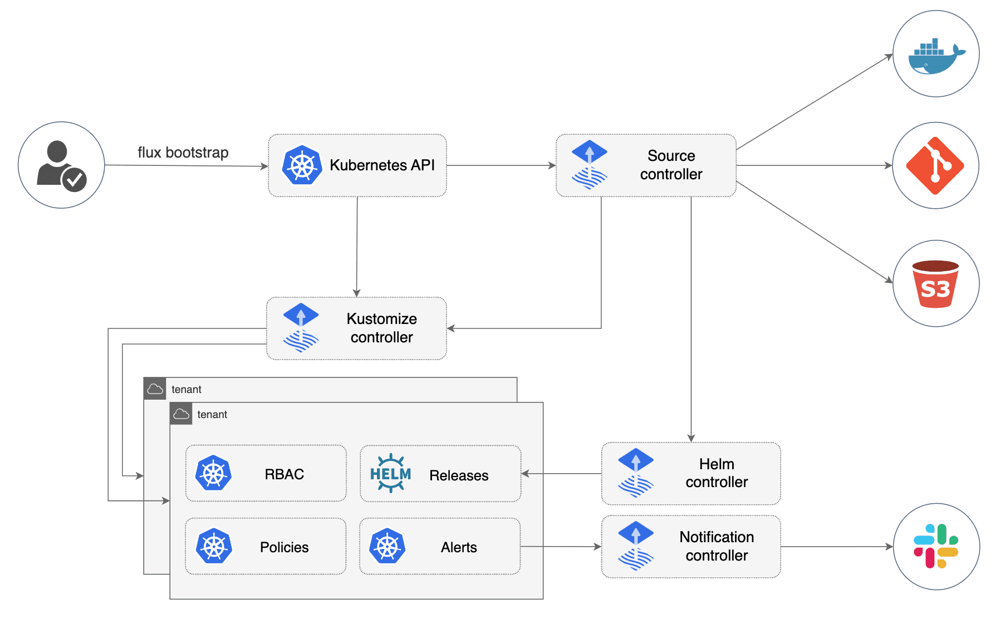

# 🚀 Day 2 – Building Your First Self-Healing Kubernetes System with Flux

**Yesterday you learned the antidote to configuration drift. Today, you build it.**

Welcome back to GitOps-Days! Day 1 transformed how you think about Kubernetes operations—from fighting fires to preventing them. You discovered how GitOps eliminates the gap between Git and your cluster, learned the four principles that make infrastructure self-healing, and gained the vocabulary to implement real change.

Now it's time to see these principles in action. You'll build your first self-healing system using Flux—a GitOps operator that continuously ensures your cluster matches Git. No more theory—just hands-on proof that your clusters really can heal themselves.

### 🗺️ Your Hands-On Journey Today

In the next 60-70 minutes, you'll:

* Set up a local Kubernetes lab environment
* Create your Git repository as the source of truth
* Install Flux and watch it come alive
* Deploy an application using only Git commits
* Deliberately break things (for science!)
* Watch your system detect and fix itself automatically

Everything runs locally—no cloud accounts, no complex setup, just Docker and some free tools.

### 🎯 What You'll Build

By the end of today's session:
- A real Kubernetes cluster with self-healing capabilities
- Flux continuously syncing your cluster with Git
- Automatic deployments triggered by `git push`
- Drift detection and correction within 60 seconds
- Confidence that you can implement this anywhere

Remember that frustration from Day 1—when manual changes caused drift? Today you'll deliberately cause drift and watch it disappear. That 3am emergency fix that haunted your documentation? Today you'll see why it can't persist in a GitOps world.

Ready to build infrastructure that refuses to stay broken? Let's turn yesterday's promise into today's reality!

## 🧰 Preparing Your Workspace

Let's start by gathering the tools that will power your self-healing system. In just 5 minutes, you'll have everything needed to build infrastructure that refuses to stay broken.

> [!TIP]
> Already have Docker, kind, kubectl, and Git installed?  
> [Jump straight to Creating Your Source of Truth](#creating-your-source-of-truth).

> [!IMPORTANT]
> This lab requires approximately 4GB of available RAM and 2GB of disk space.

### The Tools That Make GitOps Possible

Here's what each tool will do in your self-healing system:

| Tool    | Min. Version | Your GitOps Role | Installation |
| ------- | ------------ | ---------------- | ------------ |
| Docker  | ≥24.0 | **Powers your cluster** - Runs the containers that become your Kubernetes nodes | [Install Docker](https://docs.docker.com/get-docker/) |
| kind    | ≥0.25.0 | **Creates your playground** - Spins up a Kubernetes cluster on your laptop | [Install kind](https://kind.sigs.k8s.io/docs/user/quick-start/#installation) |
| kubectl | ≥1.32 | **Your Kubernetes CLI** - The command-line tool for inspecting and managing your cluster | [Install kubectl](https://kubernetes.io/docs/tasks/tools/) |
| Git     | ≥2.40 | **Your source of truth** - Where you'll declare what should be running | [Install Git](https://git-scm.com/downloads) |

**Coming Soon:** Once these are ready, we'll install Flux—the GitOps operator that watches Git and makes the magic happen.

### ✅ Quick Verification

Let's confirm your tools are ready for action:

```bash
docker --version
kind --version
kubectl version --client --short
git --version
```

You should see version numbers matching or exceeding the minimums above. If any command returns an error, revisit its installation guide.

> **Why verify?** Catching setup issues now prevents confusing errors later when you're focused on watching GitOps work its magic.

With your tools ready, let's create the Git repository that will control everything...

## 📂 Set Up Your Git Repository

With your tools ready, let's create the Git repository that will control your cluster. This is where GitOps begins.

**⏱️ Time needed:** ~3 minutes

In the next few minutes, you'll set up the repository that Flux will watch. Here's the magic: every change you make to this repository will automatically deploy to your cluster. No more `kubectl apply`. Just `git push` and watch your infrastructure update itself.

### Why Fork?

Remember from Day 1: Git is your single source of truth in GitOps. But you can't push changes to someone else's repository—you need your own. That's why we start by forking.

**Forking creates your personal copy** of a repository where:
- You have full control to make changes
- Your commits will trigger real deployments in your cluster  
- You can experiment without affecting the original

Let's set this up:

### 1️⃣ Fork the Repository on GitHub

1. Go to [`https://github.com/ahmedmuhi/GitOps-Days`](https://github.com/ahmedmuhi/GitOps-Days)
2. Click the **Fork** button at the top right
3. Click **Create fork**

You now have your own copy at:
```
https://github.com/YOUR-USERNAME/GitOps-Days
```

### 2️⃣ Clone Your Fork Locally

Now bring your repository to your local machine:

```bash
git clone https://github.com/YOUR-USERNAME/GitOps-Days.git
cd GitOps-Days
```

Verify you're working with your fork:
```bash
git remote -v
```

The output should show `origin` pointing to your repository (with YOUR-USERNAME), not the original.

> [!IMPORTANT]
> If you see `ahmedmuhi` instead of your username, you cloned the original repository instead of your fork. Delete the folder and clone your fork—you'll need write access for the GitOps magic to work!

### ✅ What You've Accomplished

- Created your own GitOps repository with full write access
- Set up the foundation for Flux to watch and deploy from
- Prepared the "source of truth" that will control your cluster

Next up: Let's create the Kubernetes cluster where your self-healing system will come to life...

## 🔄 Creating Your Kubernetes Environment

Now that your Git repository is ready, let's create the Kubernetes cluster that Flux will manage.

**⏱️ Time needed:** ~2 minutes

We'll use `kind` (Kubernetes in Docker)—a tool that creates a complete Kubernetes cluster using Docker containers. Think of it as a miniature Kubernetes that runs entirely on your laptop.

### 🏗️ Creating the Cluster

Run this command to create a cluster named `gitops-loop-demo`:

> **For Windows:** Use PowerShell or Windows Terminal  
> **For macOS/Linux:** Use Terminal

```bash
kind create cluster \
  --name gitops-loop-demo \
  --image kindest/node:v1.32.2
```

This creates a fully functional Kubernetes cluster in about a minute. We're using a specific version (`v1.32.2`) to ensure everyone gets the same experience.

### 🔍 Verifying Your Cluster

Once creation completes, confirm it's ready:

```bash
kubectl get nodes
```

You should see:
```
NAME                             STATUS   ROLES           AGE   VERSION
gitops-loop-demo-control-plane   Ready    control-plane   1m    v1.32.x
```

🎉 **Congratulations!** That "Ready" status means your cluster is up and waiting for GitOps to work its magic.

### 🎯 What You've Just Built

- ✅ A fully functional Kubernetes cluster running locally
- ✅ Your playground for self-healing experiments  
- ✅ The stage where GitOps magic will happen

> [!TIP]
> When you're done with the lab, delete the cluster with:
> ```bash
> kind delete cluster --name gitops-loop-demo
> ```
> This frees up resources and gives you a clean slate for future experiments.

With your cluster ready, it's time to install Flux—the GitOps operator that will make your infrastructure self-healing.

## 🚀 Install Flux: Your GitOps Operator

Your cluster is waiting. Let's install the GitOps engine that will bring it to life!

**⏱️ Time needed:** ~5 minutes

### What is Flux?

Flux is a [CNCF graduated project](https://fluxcd.io) that keeps your Kubernetes cluster in sync with Git repositories. Think of it as a robot that:
- **Watches** your Git repository for changes
- **Pulls** those changes automatically 
- **Applies** them to your cluster
- **Corrects** any drift that occurs

Once installed, you'll never need to run `kubectl apply` again. Just push to Git, and Flux does the rest.

### Step 1: Install Flux CLI (30 seconds)

First, install the Flux command-line tool:

**macOS:**
```bash
brew install fluxcd/tap/flux
```

**Linux:**
```bash
curl -s https://fluxcd.io/install.sh | sudo bash
```

**Windows (PowerShell):**
```powershell
choco install fluxcd
```

✅ Verify installation:
```bash
flux --version
```

### Step 2: Deploy Flux to Your Cluster (1 minute)

Now install Flux's controllers in your cluster:

```bash
flux install
```

> [!NOTE]
> This command installs the Flux controllers (Source Controller, Kustomize Controller, etc.) that will manage your cluster. They run as pods in the `flux-system` namespace.

### Step 3: Connect Flux to Your Repository (2 minutes)

Tell Flux which repository to watch:

```bash
flux create source git gitops-loop-demo \
  --url=https://github.com/YOUR-USERNAME/GitOps-Days.git \
  --branch=main \
  --interval=30s
```

> [!IMPORTANT]
> Replace `YOUR-USERNAME` with your actual GitHub username! This must point to YOUR fork, not the original repository.

This creates a "source" - Flux will check this repository every 30 seconds for changes.

### Step 4: Tell Flux What to Deploy (1 minute)

Now tell Flux what to deploy from that repository:

```bash
flux create kustomization hello-app \
  --source=GitRepository/gitops-loop-demo \
  --path="./examples/day2-gitops-loop-demo/clusters/local/apps/hello" \
  --prune=true \
  --interval=1m
```

> [!NOTE]
> This creates a "kustomization" that tells Flux:
> - **What** to deploy (contents of the hello path)
> - **How often** to check for drift (every minute)
> - **Prune=true** means deleted files = deleted resources

### ✅ Verify Flux is Healthy

Check that all Flux components are running:

```bash
flux check
```

You should see checkmarks (✓) for all components.

### 🎉 That's It! 

Flux is now:
- Watching your Git repository every 30 seconds
- Reconciling your cluster every minute
- Ready to deploy whatever you commit

**No manual deployments. Ever again.**

In the next few seconds, something magical will happen. Flux will discover the Hello World application in your repository and deploy it automatically. Let's watch it happen...

## 🔍 Your First Automatic Deployment

In the last few minutes, Flux has been busy. Remember that path we pointed it to? Let's see what it found there and what it's done with it.

**⏱️ Time needed:** ~5 minutes

### What Flux Discovered in Your Repository

When we connected Flux to your repository, we pointed it to a specific path. Inside that path, Flux found these files:

```
examples/day2-gitops-loop-demo/clusters/local/apps/hello/
├── namespace.yaml      # Creates the 'hello' namespace
├── deployment.yaml     # Defines pods running the web server
└── service.yaml        # Exposes the app on port 80
```

These YAML files define a Hello World web application. Flux found your application in Git and **deployed it automatically**.

### Let's See What Flux Created

Check your cluster for these resources:

```bash
kubectl get pods,svc -n hello
```

You should see:
```
NAME                         READY   STATUS    RESTARTS   AGE
pod/hello-65d4c4d5c9-xz7vp   1/1     Running   0          2m

NAME            TYPE        CLUSTER-IP      PORT(S)   AGE
service/hello   ClusterIP   10.96.x.x       80/TCP    2m
```

> [!NOTE]
> Notice the AGE column - these resources were created minutes ago by Flux, not by you.

### The Automatic Deployment in Action

Think about this for a moment:
- ❌ You didn't run `kubectl apply`
- ❌ You didn't push any commits
- ❌ You didn't trigger any pipelines
- ✅ Yet your application is running!

Flux found the files, understood what they meant, and deployed them. This is GitOps working exactly as promised.

### Access Your Running Application

Let's see the app that Flux deployed:

```bash
kubectl port-forward -n hello svc/hello 8080:80
```

Open [http://localhost:8080](http://localhost:8080) in your browser.

🎉 **There it is!** Your Hello World app, running in Kubernetes, deployed entirely by Flux.

### How This Happened

The sequence was simple:
1. You told Flux to watch a path in your repository
2. Flux found YAML files there
3. Flux applied them to your cluster
4. Your app started running

No manual steps. No kubectl commands. Just Git and Flux working together.

### This Changes Everything

In traditional Kubernetes, you would:
- Run `kubectl apply -f namespace.yaml`
- Then `kubectl apply -f deployment.yaml`  
- Then `kubectl apply -f service.yaml`
- Hope nothing goes wrong

With GitOps, you:
- Point Flux at your repository
- Let it handle everything else

> [!TIP]
> Press `Ctrl+C` to stop the port-forward. Your app will keep running.

But here's the best part: This system doesn't just deploy automatically—it HEALS automatically too.

Ready to have some fun? Let's break things (For Science!) and watch Flux fix them...

## 🔨 Breaking Things (For Science!)

Now let's do what would normally cause a 3am wake-up call—and watch your system heal itself automatically.

**⏱️ Time needed:** ~5 minutes

Remember that drift anxiety from Day 1? The fear that someone's manual change could break production? Time to face that fear head-on and watch it become powerless against GitOps.

### Why These Tests Matter

We're about to simulate two real-world scenarios that happen all too often:
1. **The "Quick Fix"** - Someone scales a deployment manually during an incident
2. **The "Accident"** - Someone deletes critical resources by mistake

In traditional Kubernetes, these would persist until discovered. With GitOps? Let's see...

### 🧪 Test 1: The Emergency Scale

First, let's simulate a colleague "temporarily" scaling your deployment:

```bash
kubectl scale deployment hello -n hello --replicas=0
```

Now watch what happens in real-time:
```bash
kubectl get deployment hello -n hello -w
```

> [!NOTE]
> The `-w` flag means "watch" - it shows live updates as they happen

Within 30-60 seconds, you'll see:
```
NAME    READY   UP-TO-DATE   AVAILABLE   AGE
hello   1/1     1            1           10m
hello   0/1     0            0           10m      # Your manual change
hello   0/1     0            0           10m30s   # Flux notices drift
hello   0/1     1            0           10m35s   # Flux starts fixing
hello   1/1     1            1           10m40s   # Back to normal!
```

🎉 **Did you see that?!** Your deployment healed itself! No alerts, no manual intervention—just automatic correction.

> [!TIP]
> Press `Ctrl+C` to stop watching

### 🧪 Test 2: The Catastrophic Delete

Let's escalate. Delete EVERYTHING:

```bash
kubectl delete namespace hello
```

This completely removes:
- Your deployment ✗
- Your service ✗
- All pods ✗
- The entire namespace ✗

Now watch Flux rebuild from scratch:
```bash
watch kubectl get all -n hello
```

Every 2 seconds, you'll see the namespace and all resources being recreated. Within a minute, your application is back as if nothing happened.

> [!TIP]
> Press `Ctrl+C` when you see everything running again

### 📊 Understanding the Timing

Why did it take 30-60 seconds? Because we configured:
- **Source check**: Every 30 seconds (checks Git for changes)
- **Reconciliation**: Every 60 seconds (checks for drift)

```bash
flux events --for Kustomization/hello-app
```

You'll see entries like:
```
Reconciliation finished in 1.2s, next run in 1m0s
```

> [!NOTE]
> Want faster healing? Adjust the intervals when creating the source and kustomization. But remember: more frequent = more API calls.

### 💡 The Real-World Impact

Those manual fixes that drift from Git? **They literally cannot persist.**

- **Accidental deletion?** Flux rebuilds automatically
- **Emergency scaling?** Flux restores the declared state
- **Configuration drift?** Flux reverts to Git's truth
- **That 3am fix?** Better commit it to Git, or it's gone in 60 seconds

This is self-healing infrastructure in action. Your Git repository isn't just documentation—it's the enforced reality.

You've now proven that drift is impossible in a GitOps world. But HOW did Flux detect and fix these changes so quickly? Let's peek under the hood...

## 🔧 How Flux Works Under the Hood (Optional Deep Dive)

You've built a self-healing system and seen it work beautifully. For the rest of your GitOps journey (Days 3-5), you'll explore more advanced patterns with Flux. Understanding Flux's architecture now will make those advanced concepts much clearer.

**⏱️ Time needed:** ~5 minutes (or skip to Day 2 Complete if you're satisfied!)

### The Two-Controller Architecture

When you ran `flux install`, you deployed several controllers into your cluster. Let's focus on the two main ones that powered everything you just saw:



Looking at the diagram, you can see:

1. **Source Controller** (top) - Your Git watchdog
   - Connects to Git repositories (GitHub, GitLab, etc.)
   - Pulls changes every 30 seconds (remember our `--interval=30s`?)
   - Stores the files for other controllers to use

2. **Kustomize Controller** (middle) - Your cluster enforcer
   - Takes files from Source Controller
   - Applies them to your cluster
   - Detects and fixes drift every 60 seconds

But how do these controllers know what to watch and what to deploy? That's where those commands you ran become important...

### The Instructions You Gave Flux

Those two `flux create` commands weren't just setup steps—they created specific instructions for each controller.

**First, you created a GitRepository resource:**
```yaml
apiVersion: source.toolkit.fluxcd.io/v1
kind: GitRepository
metadata:
  name: gitops-loop-demo
spec:
  interval: 30s          
  url: https://github.com/YOUR-USERNAME/GitOps-Days.git
  ref:
    branch: main
```

This GitRepository tells the Source Controller: "Watch this specific GitHub repository. Check it every 30 seconds. If you find new commits on the main branch, download the files." Think of it as a subscription—the Source Controller now subscribes to your repository.

**Then, you created a Kustomization resource:**
```yaml
apiVersion: kustomize.toolkit.fluxcd.io/v1
kind: Kustomization
metadata:
  name: hello-app
spec:
  interval: 1m           
  sourceRef:
    kind: GitRepository
    name: gitops-loop-demo
  path: "./examples/day2-gitops-loop-demo/clusters/local/apps/hello"
  prune: true
```

This Kustomization tells the Kustomize Controller: "Look at the files the Source Controller downloaded from 'gitops-loop-demo'. Specifically, go to the hello app path. Apply whatever YAML you find there to the cluster. Check every minute if reality matches those files. Oh, and if files get deleted from Git, delete the corresponding resources too (that's what prune means)."

These two resources create a complete GitOps pipeline—from Git to cluster, automatically.

### How Controllers Collaborate During Reconciliation

Let's trace what happened during your scaling test to see this collaboration:

The Source Controller runs its check every 30 seconds:
- "Time for my regular check of the Git repository"
- "Still showing replicas: 1 in the deployment.yaml"
- "No changes to download, but I'll keep the files ready"

Meanwhile, the Kustomize Controller runs its reconciliation every 60 seconds:
- "Let me compare what's in the cluster to what Source Controller has"
- "Wait, the cluster shows 0 replicas but the files say 1"
- "That's drift! Applying the correct state now..."
- "Done. Deployment back to 1 replica"

This separation is powerful—one controller focuses on Git, the other on the cluster. They collaborate through those GitRepository and Kustomization resources you created, each doing their specialized job.

That's the engine behind your self-healing infrastructure. Simple, elegant, and now revealed.

Ready to celebrate what you've built?

## 🏆 Day 2 Complete: You Built the Impossible

You just did something most Kubernetes users only dream about—you built infrastructure that heals itself. Not in theory. Not in a demo. On your actual laptop, with real code.

### Your GitOps Transformation

**You started this morning with:**
- Just Docker and some tools
- Hope that self-healing was possible
- Memories of drift-induced headaches

**You're ending with:**
- A Kubernetes cluster that refuses to drift
- Flux watching your Git repository like a guardian
- Proof that 3am fixes can't persist
- Deep understanding of how GitOps delivers its magic

### What You Actually Built

- ✅ A complete GitOps pipeline (Git → Flux → Cluster)
- ✅ Automatic deployment from Git commits
- ✅ Self-healing that fixes drift in <60 seconds
- ✅ Your first taste of "kubectl-free" life

And if you did the deep dive, you also understand the two-controller architecture powering it all.

### The "Never Again" List

After today, you'll never again have to:
- ❌ Wonder if production matches Git
- ❌ Run `kubectl apply` for deployments
- ❌ Worry about undocumented manual changes
- ❌ Fear that someone's "quick fix" will persist
- ❌ Lose sleep over configuration drift

This isn't wishful thinking—you proved it works.

### The Journey So Far

**Day 1**: You understood why GitOps exists and how it works  
**Day 2**: You built proof that it actually works  
**Day 3**: Next, you'll take this to the cloud with AKS

### Your GitOps Capabilities

You can now:
- Explain GitOps with concrete examples (because you've seen it work)
- Deploy applications without touching kubectl
- Trust that your clusters will self-heal

### Tomorrow: Cloud Scale

Day 3 takes your local success to the cloud. You'll face new challenges:
- Deploy GitOps on Azure Kubernetes Service (AKS)
- Handle cloud-specific challenges
- Implement production-ready patterns
- See how this scales beyond your laptop

But here's the thing: the hard part is done. You understand GitOps. Tomorrow is just applying it at scale.

> [!TIP]
> Before tomorrow, try experimenting:
> - Change the replicas in your Git repo and watch Flux update it
> - Break things in new ways—Flux will keep fixing them!

### You Did It! 🎉

From "drift anxiety" to "drift immunity" in one day. That's not just learning—that's transformation.

Your clusters will never be the same. Neither will your weekends.

**See you tomorrow for Day 3!**

[Continue to Day 3: GitOps in the Cloud →](link)

---

*P.S. Proud of what you built? Share your success! #GitOpsDays*